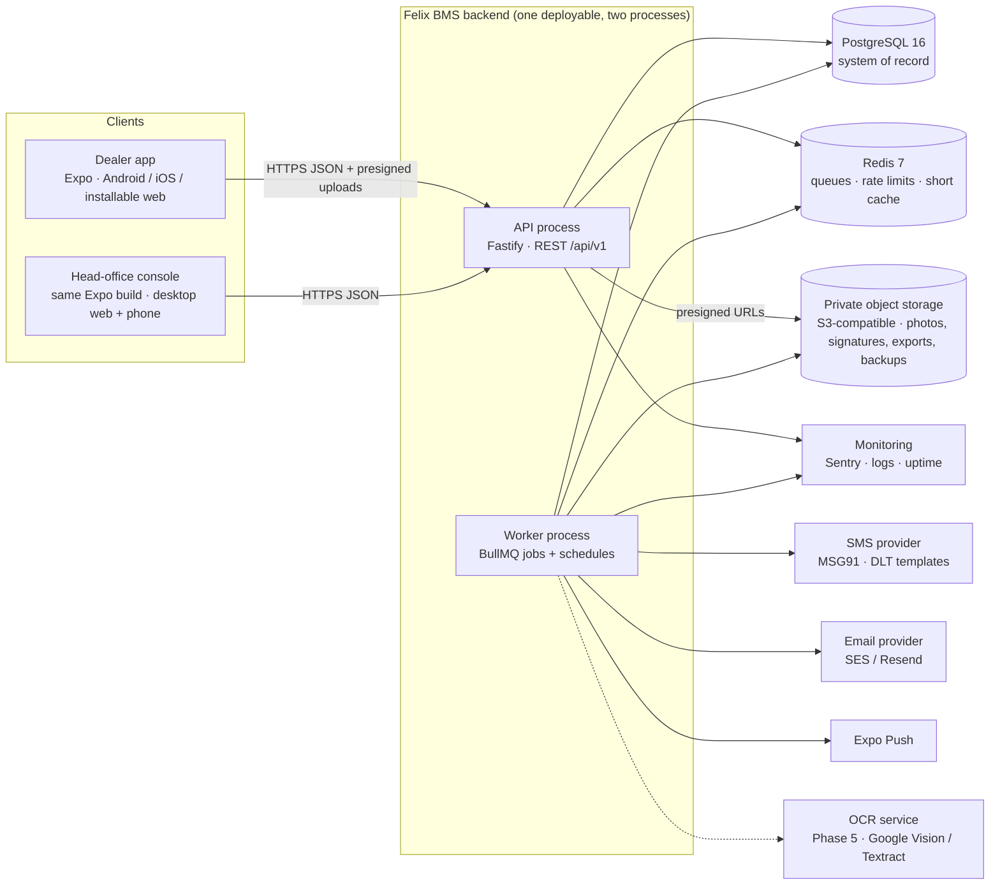
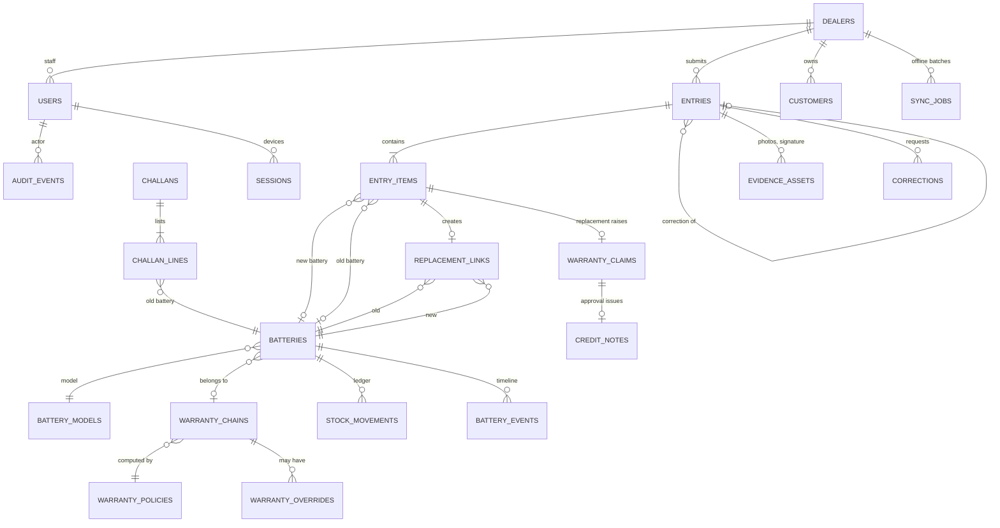

# Felix BMS — Backend Architecture

Version 1.0 · 14 September 2026 · Status: **approved for build** (pending the Phase 0 decisions listed in `memory.md`)

This is the technical design for the server side of the Felix Batteries "Battery Lifecycle & Dealer Management Platform" (PRD v3.0). It is written so one developer can implement it module by module, in the order given in `phases.md`, without having to re-derive decisions. Engineering conventions live in `rules.md`; module-by-module ownership, endpoints and dependencies in `modules.md`; project context and glossary in `memory.md`; the running work log in `logs.md`.

---

## 0. How to read this document

| If you want to… | Read |
|---|---|
| Understand what the server must never get wrong | §1 |
| See the moving parts and the stack | §2–§5 |
| Implement request handling, auth, permissions | §6–§7 |
| Create the database | §8 |
| Implement business rules | §9 |
| Implement offline sync, photos, notifications, reports, import, search | §10–§15 |
| Run it in production | §16–§18 |
| Wire endpoints | §19 |
| Connect the existing Expo app | §20 |
| Know which module owns a table, endpoint or screen | `modules.md` |

Terms: **Entry** = one transaction header submitted by a dealer; **Item** = one battery line inside an entry; **Battery code** = the full 8-digit printed code (e.g. `21030047`); **Serial** = the short serial derived from it (`0047`); **Chain** = the linked list of batteries from the first sale through every replacement; **Cover** = the warranty period that belongs to the chain, not to the battery; **Claim** = the commercial warranty decision attached to a replacement item; **Challan** = the material-return document for old batteries going back to the company. Full glossary in `memory.md`.

---

## 1. What the backend must guarantee (invariants)

Every design choice below exists to make these true. They are also the mandatory test scenarios (`rules.md §9`).

| # | Invariant | PRD source |
|---|---|---|
| I-1 | **Warranty never restarts.** A replacement inherits the chain's original start, expiry and policy version. No API, import, admin screen or migration can write an expiry date directly; only an approved, audited override can move it, and the original working is kept beside it. | §12 WAR-01..06, AC-06 |
| I-2 | **Nothing is hard-deleted.** Batteries, entries, items, replacement links, stock movements, claims, audit events and evidence are append-only or soft-deleted. Enforced by database triggers, not only by code. | §19, §26 deletion policy |
| I-3 | **Dealer isolation.** A dealer principal can never read or write another dealer's entries, batteries, customers, evidence, exports or notifications — through list, detail, search, export, sync or a guessed ID. `dealer_id` always comes from the token, never from the request body. | §25, AC-11 |
| I-4 | **Serials are text.** Leading zeros are preserved in storage, API, search and every export (XLSX cells typed as text). The originally entered value is retained beside the normalised value. | §10, §21 FR-REP-02 |
| I-5 | **Server validation is authoritative.** The same rule set runs on the server for online submissions, offline sync and admin-entered records. The app's validation is a convenience copy of the same code. | §23 |
| I-6 | **Exactly once.** A submission carrying a client key is created at most once, online or after offline sync; a replay returns the original result. | §9.1, AC-07 |
| I-7 | **Every state change is reasoned and audited.** Who, role, when, what, before/after, reason, request id, IP/device. Refused actions are logged too. | §19, §25 |
| I-8 | **Account status is evaluated on every request.** A suspended dealer or blocked admin is stopped on their next call, including a queued sync. | §7 FR-ONB-02 |
| I-9 | **Stock is derived, never stored.** Positions are computed from the movement ledger; a wrong movement is corrected by a new movement. | §15 |
| I-10 | **Exceptions are surfaced, not merged.** When server truth changed after a draft was made, the entry lands in the exception queue for a human. | §16 FR-SYNC-03 |

---

## 2. System context



One codebase produces two processes: the **API** (stateless, horizontally scalable) and the **worker** (queues, schedules, exports, notifications). Both read the same config and the same database. Nothing else talks to the database.

---

## 3. Technology choices

| Layer | Choice | Why this, not the alternative |
|---|---|---|
| Language / runtime | **TypeScript 5 on Node.js 22 LTS** | The app is TypeScript and `src/domain.ts` already holds the warranty, serial and validation rules with passing tests. Sharing that code with the server (I-5) is the single biggest quality win. Laravel (PRD option) would mean re-implementing and keeping two rule sets in sync. |
| HTTP framework | **Fastify 5** with `fastify-type-provider-zod` | Schema-first, fast, small. Zod schemas double as request validation *and* generated OpenAPI. NestJS is the alternative if the team prefers heavy structure; it adds ceremony without adding capability here. |
| Validation | **Zod** | Same library on client and server; schemas live in the shared domain package. |
| Database | **PostgreSQL 16** | Transactions, partial/unique indexes, `pg_trgm` for serial/customer search, JSONB for audit before/after, row-level security available as defence in depth, triggers to enforce immutability. MySQL (PRD option) lacks the trigram and RLS ergonomics. |
| ORM / migrations | **Drizzle ORM + drizzle-kit** | SQL-shaped, fully typed, migrations are plain SQL files you can read. Prisma is the alternative; avoid its runtime engine on small VPSs. |
| Queue / cache | **Redis 7 + BullMQ** | Jobs (SMS, email, push, exports, scheduled reports, nightly scans), rate limiting, 30-second account-status cache. |
| Object storage | **S3-compatible** (AWS S3 or Cloudflare R2; MinIO locally) | Private bucket, presigned PUT/GET, lifecycle rules, versioning. |
| Auth | **Argon2id** passwords · **JWT (HS256, 15 min)** access tokens · **opaque rotating refresh tokens** (hashed, 30 days, device-bound) · **OTP** by SMS/email · admin **2FA** (email OTP now, TOTP later) | Standard, auditable, no third-party identity dependency. |
| Files | **exceljs** (streaming XLSX with text cells), **pdfkit** or headless Chromium for PDF | Leading-zero fidelity is a hard requirement (I-4). |
| Logging / errors | **pino** JSON logs · **Sentry** | Structured logs with request id; error grouping. |
| Tests | **Vitest** · Postgres via Docker (Testcontainers) · Fastify `inject` | Real database in integration tests; no mocking of SQL. |
| Packaging | **Docker** · docker-compose (dev + small prod) · GitHub Actions CI | Reproducible; one VPS is enough for years at this data volume (see §21). |
| API docs | OpenAPI 3.1 generated from Zod, served at `/api/docs` in non-production | Contract the app team can code against. |

Pinned versions are recorded in `memory.md §Environment` when Phase 0 completes.

---

## 4. Repository and code layout

The backend lives in `backend/` inside the existing project. The pure domain rules move to a shared package that **both** the Expo app and the backend import, so a rule is written once.

```
Flix baterry/
  App.tsx, src/…                     # existing Expo app (dealer + head office UI)
  packages/
    domain/                          # NEW · pure TypeScript, zero React, zero DB
      src/
        ids.ts                       # id formats + regexes (ENT-, CLM-, FBI-RT-, CN-)
        serials.ts                   # normalise(), deriveCode(), pattern checks per family
        warranty.ts                  # expiryFrom(), warrantyStatus(), remaining(), inherit()
        entryRules.ts                # validateEntry() — the authoritative rule set
        dates.ts                     # todayKolkata(), monthKey(), withinBackdateWindow()
        stock.ts                     # STATES, TRANSITIONS, effectOf(entryType)
        status.ts                    # entry / claim / dealer / admin state machines
        schemas/*.ts                 # Zod schemas for API payloads (shared)
        index.ts
      test/                          # the current tests/domain.test.ts moves here, grows
  backend/
    architecture.md phases.md memory.md logs.md rules.md
    package.json tsconfig.json .env.example Dockerfile docker-compose.yml drizzle.config.ts
    src/
      server.ts                      # boots API
      worker.ts                      # boots BullMQ workers + schedules
      app.ts                         # buildApp(): registers plugins + modules (used by tests)
      config/env.ts                  # typed env (Zod), fails fast on missing keys
      db/
        client.ts                    # pg Pool + drizzle, withTransaction()
        schema/*.ts                  # one file per table group
        migrations/                  # drizzle-kit SQL, forward-only
        seed/                        # masters, first Main Admin, demo data (dev only)
      lib/
        errors.ts                    # AppError(code, status, message, field?, nextAction?)
        ids.ts                       # uuidv7(), nextRef(kind, tx)
        crypto.ts                    # argon2, sha256, random tokens, OTP
        audit.ts                     # audit(tx, {...}) — the only way to write audit_events
        outbox.ts                    # enqueueEvent(tx, …) — transactional outbox
        storage.ts                   # presign put/get, head, delete-never
        sms.ts email.ts push.ts      # provider adapters behind interfaces
        pagination.ts                # cursor helpers
        logger.ts                    # pino with redaction
        ratelimit.ts                 # Redis token buckets
      plugins/
        requestId.ts auth.ts accountStatus.ts rbac.ts dealerScope.ts
        zod.ts openapi.ts errorHandler.ts etag.ts idempotency.ts
      modules/                       # one folder per module — ownership and dependencies in modules.md
        health/ auth/ users/ admins/ dealers/ masters/ settings/ audit/
        batteries/ warranty/ stock/ evidence/ customers/
        entries/ approvals/ (exception queue lives here) corrections/ claims/ credits/ returns/
        sync/ search/ reports/ (analytics lives here) imports/ notifications/
          routes.ts   # Fastify routes (thin)
          service.ts  # use-cases; every write = one transaction
          repo.ts     # SQL via drizzle; dealer scope enforced here
          schemas.ts  # Zod I/O (imports shared schemas where possible)
          *.test.ts
      jobs/
        exports.ts scheduledReports.ts notificationsDispatch.ts
        warrantyExpiring.ts lowStock.ts syncReconcile.ts retention.ts evidenceScan.ts
    test/
      setup.ts factories.ts
      scenarios/AC-01…AC-12.test.ts  # PRD acceptance criteria as executable tests
```

If the team decides against a pnpm workspace in Phase 0, the fallback is: keep `src/domain.ts` in the app, copy it to `backend/src/domain/` and add a CI check that the two files are byte-identical. The workspace is strongly preferred.

---

## 5. Runtime topology and configuration

### 5.1 Environments

| Env | Where | Data | Purpose |
|---|---|---|---|
| `local` | docker-compose on the developer machine: postgres, redis, minio, mailpit | seeded demo data | daily development |
| `staging` | one VPS (2 vCPU / 4 GB) or small cloud instance, Docker Compose, Caddy TLS | migrated sample register | UAT per phase (PRD §31) |
| `production` | VPS 4 vCPU / 8 GB (or managed Postgres + 2 small app instances), Caddy TLS, nightly backups | live | go-live at P4 |

Processes per environment: `api` (2 replicas in prod), `worker` (1), `postgres`, `redis`, `caddy`. Object storage is external (R2/S3) in staging and prod, MinIO locally.

### 5.2 Configuration (environment variables)

All read once at boot through `config/env.ts` (Zod-validated; the process refuses to start if a required key is missing).

```
NODE_ENV=production|staging|development
PORT=8080
API_BASE_URL=https://api.felixbatteries.in
APP_BASE_URL=https://app.felixbatteries.in          # used in notification links
DATABASE_URL=postgres://…                            # pooled connection
DATABASE_POOL_MAX=10
REDIS_URL=redis://…
JWT_SECRET=<32+ random bytes>                        # rotate with JWT_SECRET_PREVIOUS
JWT_SECRET_PREVIOUS=
ACCESS_TOKEN_TTL=15m
REFRESH_TOKEN_TTL=30d
OTP_TTL=5m  OTP_LENGTH=6  OTP_MAX_ATTEMPTS=5  OTP_DEMO_CODE=            # demo code only in non-prod
STORAGE_ENDPOINT= STORAGE_REGION= STORAGE_BUCKET= STORAGE_ACCESS_KEY= STORAGE_SECRET_KEY=
STORAGE_PRESIGN_PUT_TTL=10m  STORAGE_PRESIGN_GET_TTL=5m
SMS_PROVIDER=msg91|console  SMS_API_KEY=  SMS_SENDER_ID=  SMS_DLT_ENTITY_ID=
EMAIL_PROVIDER=ses|resend|console  EMAIL_FROM=
PUSH_PROVIDER=expo|console
SENTRY_DSN=
LOG_LEVEL=info
RATE_LIMIT_ENABLED=true
BACKDATE_WINDOW_DAYS=30                              # overridable in settings table
EXPORT_SYNC_MAX_ROWS=5000
EXPORT_LINK_TTL=24h
TZ=Asia/Kolkata                                      # business time zone for dates and exports
```

Secrets never live in git. `console` providers print to the log in development.

---

## 6. Request lifecycle

Every request passes through the same pipeline, in this order. Handlers stay thin; services own the rules.

```
requestId → logger → CORS/helmet → rate limit → auth (JWT) → accountStatus (DB/Redis, ≤30 s stale)
→ rbac (permission for route) → dealerScope (dealer principals get ctx.dealerId; admins may pass ?dealerId)
→ Zod body/query/params → service → [transaction: writes + audit() + outbox()] → response
→ errorHandler (AppError → envelope; unknown → 500 + Sentry)
```

### 6.1 Conventions

| Topic | Rule |
|---|---|
| Base path | `/api/v1`. Breaking changes go to `/api/v2`; additive changes do not bump. |
| JSON | camelCase in JSON (matches the app types), snake_case in the database. Dates as ISO strings; business dates (`entryDate`, `warrantyStart`) as `YYYY-MM-DD`; timestamps as RFC 3339 UTC. Money as integer rupees (`4250`); credit notes never need decimals. |
| IDs | Primary keys are UUIDv7 (generated in code). Human references (`ENT-26-09-0414`, `CLM-…`, `FBI-RT-2609-01`, `CN-26-09-0188`, dealer code `FPP-014`) are separate, unique, immutable, searchable. Routes accept either where sensible (`/entries/{idOrRef}`). |
| Pagination | Cursor-based: `?limit=50&cursor=…` → `{ items, nextCursor }`. Max `limit` 200. Every list endpoint supports `sort` from an allow-list. |
| Filtering | Query params named after the filter model in §13.1 so a saved report and a list share the same parser. |
| Errors | `{ "error": { "code": "duplicate_serial", "message": "This serial is already active with a customer.", "field": "items.0.code", "nextAction": "Check the label or search the serial." , "details": {…} } }`. HTTP 400 malformed, 401 unauthenticated, 403 forbidden (includes suspended), 404 not found or not in scope (never distinguish), 409 conflict/idempotency mismatch, 412 ETag mismatch, 422 validation, 429 rate-limited. |
| Concurrency | Mutable records (dealers, customers, models, policies, saved reports) return `ETag`; `PATCH` requires `If-Match`; mismatch → 412. |
| Idempotency | Any POST that creates a business record accepts `Idempotency-Key` (dealer submissions **must** send `clientKey` in the body; see §10). Replays return the stored response with `Idempotent-Replay: true`. Keys expire after 30 days. |
| Time zone | Stored in UTC; business dates computed in `TZ` (Asia/Kolkata). "Today" is Kolkata's today (the app bug fixed on 14 Sep 2026 was exactly this). |
| Headers | `X-Request-Id` (echoed), `X-Device-Id` (client-generated, stored on sessions/sync jobs), `X-App-Version`. |

---

## 7. Identity, authentication and permissions

### 7.1 Principals

| Principal | Signs in with | Scope | Notes |
|---|---|---|---|
| Dealer staff (`dealer_manager`, `dealer_user`) | mobile + OTP (primary, matches the approved dealer UI) **or** email + password + OTP | exactly one `dealer_id` | `dealer_manager` can invite/disable staff of the same dealer only. |
| Head office (`main_admin`, `co_admin`, `operations`, `inventory_manager`, `read_only`) | email + password + second factor (email OTP; TOTP optional later) | all dealers | `main_admin` is the only role that can manage admin accounts and warranty policy. |
| Service (jobs, migrations) | none (in-process) | all | Audit actor recorded as `system`. |

`users` is one table with `scope` (`dealer` / `admin`). A user's live status **and** their dealer's status are checked on every request (I-8) via a 30-second Redis cache keyed by user id; status changes invalidate the key immediately.

### 7.2 Login flows

```mermaid
sequenceDiagram
  participant App
  participant API
  participant SMS
  App->>API: POST /auth/otp/request {mobile:"9876543210", purpose:"login", deviceId}
  API->>API: rate limit (5 / 15 min / mobile, 20 / hour / IP); find active dealer user
  API->>SMS: send OTP (hashed copy stored, TTL 5 min, max 5 attempts)
  API-->>App: 200 {challengeId, resendAfter: 30}
  App->>API: POST /auth/otp/verify {challengeId, code, deviceId}
  API->>API: verify hash, consume, check user+dealer status
  API-->>App: 200 {accessToken (15 min), refreshToken (30 d, opaque), user, dealer, permissions}
  App->>API: … Authorization: Bearer <access> …
  App->>API: POST /auth/refresh {refreshToken}
  API->>API: rotate: revoke old, issue new; reuse of a revoked token revokes the whole family
```

Admin login: `POST /auth/login {email, password}` → `202 {challengeId}` → `POST /auth/otp/verify` with the emailed code → tokens. Password reset: `POST /auth/password/forgot` → OTP → `POST /auth/password/reset`. Registration (`POST /dealers/register`) requires a verified mobile: the app calls `/auth/otp/request purpose:"register"` then sends the `challengeId + code` with the form.

Password policy: ≥ 8 characters, not equal to mobile/email/shop name, checked against a small breached-password list; Argon2id (m=64 MiB, t=3). Sessions are listed and revocable (`GET/DELETE /auth/sessions`). Every sign-in, refresh reuse, OTP failure and lock-out is audited.

### 7.3 Permission catalogue

Permissions are strings checked by the `rbac` plugin per route (`fastify.route({ config: { permission: 'entries.approve' } })`) and again inside services for record-level rules.

| Domain | Keys |
|---|---|
| Entries | `entries.read` `entries.create` `entries.submit` `entries.approve` `entries.review` `entries.reject` `entries.correct` `entries.void` `entries.exceptions.resolve` |
| Corrections | `corrections.request` `corrections.decide` |
| Dealers | `dealers.read` `dealers.approve` `dealers.suspend` `dealers.edit` `dealers.staff.manage` `dealers.code.assign` |
| Batteries / masters | `batteries.read` `batteries.import` `masters.manage` (models, cities, entry types, reason codes, serial rules) |
| Warranty | `warranty.read` `warranty.policy.manage` `warranty.override.request` `warranty.override.approve` |
| Claims / returns | `claims.read` `claims.accept` `claims.decide` `returns.dispatch` `returns.receive` `returns.process` `credits.issue` `credits.adjust` |
| Stock | `stock.read` `stock.post` `stock.thresholds` |
| Customers | `customers.read` `customers.write` `customers.merge` |
| Evidence | `evidence.upload` `evidence.read` |
| Reports | `reports.run` `reports.export` `reports.schedule` `reports.history.read` |
| Notifications | `notifications.read` `notifications.send` `notifications.templates.manage` |
| Governance | `audit.read` `admins.manage` `settings.manage` `sync.reconcile` |

Role templates (seeded, editable by `main_admin` except the escalation rules):

| Role | Template |
|---|---|
| `dealer_user` | `entries.read/create/submit`, `corrections.request`, `batteries.read`, `warranty.read`, `claims.read`, `returns.dispatch`, `stock.read`, `customers.read/write`, `evidence.*`, `reports.run/export` (own dealer only), `notifications.read` |
| `dealer_manager` | `dealer_user` + `dealers.staff.manage` (own dealer) |
| `main_admin` | everything |
| `co_admin` | everything except `admins.manage`, `warranty.policy.manage`, `settings.manage`; individual keys switched on/off per account ("if granted", PRD §5) |
| `operations` | `entries.*`, `corrections.decide`, `claims.*`, `returns.*`, `evidence.read`, `reports.run`, `notifications.read` |
| `inventory_manager` | `stock.*`, `returns.receive/process`, `batteries.read`, `reports.run` |
| `read_only` | every `*.read` + `reports.run`; no writes, no export of customer contact fields |

Rules enforced in code and tests: dealer-scoped roles are always filtered by `ctx.dealerId`; a grantor can only grant keys they hold; `admins.manage` and `warranty.policy.manage` can only be held by `main_admin`; nobody can change their own role; `co_admin` cannot create, edit or delete any admin.

### 7.4 Dealer scoping — the mechanics

* `dealerScope` plugin sets `ctx.dealerId` from the token for dealer principals and **ignores** any `dealerId` in the body/query.
* Every repository function that touches a dealer-owned table takes `ctx` and adds `WHERE dealer_id = ctx.dealerId` when `ctx.scope === 'dealer'`. A lint rule forbids importing the raw db client inside `modules/*/routes.ts`.
* Defence in depth (Phase 4): PostgreSQL RLS policies on dealer-owned tables using `current_setting('app.dealer_id')`, set with `SET LOCAL` inside each transaction.
* Detail endpoints return 404, not 403, for records outside scope (no existence leak).
* Exports and search go through the same repositories, so isolation is automatic (AC-11 test asserts this on all four paths: list, detail, search, export).

---

## 8. Data model

### 8.1 Conventions

* Every table: `id uuid pk`, `created_at timestamptz default now()`, `updated_at` (mutable tables only), `deleted_at` + `deleted_by` + `delete_reason` for soft delete where allowed.
* Append-only tables (`audit_events`, `stock_movements`, `battery_events`, `replacement_links`, `entry_items` after submission, `outbox`) have triggers that raise on `UPDATE`/`DELETE`.
* Enums are Postgres enums; values snake_case (mapping to app labels in `memory.md §Status mapping`).
* Money: `integer` rupees. Business dates: `date`. Months: `char(7)` `YYYY-MM`.
* All dealer-owned tables carry `dealer_id` (denormalised on purpose for scoping and indexing).

### 8.2 Entity relationship (core)



### 8.3 Tables

Notation: `pk` primary key, `fk→table` foreign key, `uq` unique, `idx` index, `!` not null. Types are PostgreSQL.

```
-- MASTER DATA ------------------------------------------------------------
cities                 id uuid pk · name text uq! · state text! · active bool! default true
battery_models         id text pk ("M5") · family text! ("M"|"B"|"S"|"I") · type text! ("IT tall tubular")
                       capacity text · warranty_months int! default 24 · reorder_threshold int! default 5
                       active bool! · sort int · created_at · updated_at
serial_rules           id uuid pk · family text uq! · pattern text! (regex, default '^\d{8}$')
                       short_serial_from int! (5) · short_serial_len int! (4) · mfg_from_prefix bool! (YYMM)
                       duplicate_policy enum(block, exception_queue)! default block · notes text
entry_types            id text pk ("replacement") · label text! · label_mr text · sort int
                       old_serial enum(required, optional, none)! · stock_effect jsonb! (see §9.6)
                       warranty_effect enum(continues_chain, starts_warranty, out_of_warranty, claim_context, none)!
                       requires_remark bool! · evidence_rules jsonb! ({required:[...], optional:[...]})
                       dealer_visible bool! · active bool!
reason_codes           id uuid pk · category enum(fault, stock_adjustment, refusal, override, void)! · code text! · label text!
                       active bool! · uq(category, code)
inventory_locations    id uuid pk · name text! ("Nashik warehouse") · kind enum(company, dealer)! · dealer_id fk→dealers null
                       active bool!
credit_rates           id uuid pk · model_id fk→battery_models! · amount int! (rupees) · effective_from date!
                       created_by fk→users · uq(model_id, effective_from)
settings               key text pk · value jsonb! · updated_by fk→users · updated_at
                       -- backdate_window_days, claim_decision_mode ('after_inspection'|'on_entry_approval'),
                       -- near_duplicate_warning_distance (1), export_link_ttl_hours, notification defaults

-- IDENTITY ---------------------------------------------------------------
dealers                id uuid pk · dealer_code text uq null (assigned at approval; immutable after; regex ^[A-Z]{2,4}-\d{3}$)
                       name text! · contact_person text! · mobile text uq! (10 digits) · email text uq null (citext)
                       city_id fk→cities! · state text! · pin char(6)! · place text · address text!
                       status enum(pending_approval, active, rejected, suspended)! · status_reason text
                       status_changed_at timestamptz · status_changed_by fk→users
                       registered_via enum(self, admin)! · created_at · updated_at · deleted_at
                       idx(status), idx(city_id), gin(name gin_trgm_ops)
users                  id uuid pk · scope enum(dealer, admin)! · dealer_id fk→dealers null (required when scope=dealer)
                       name text! · mobile text null (uq where not null) · email citext null (uq where not null)
                       password_hash text null · role text! (fk→roles.key) · status enum(active, temporarily_blocked, inactive, soft_deleted)!
                       status_reason text · last_login_at · mfa enum(none, email_otp, totp)! default email_otp for admins
                       totp_secret_enc text · language enum(en, mr)! default en · sms_alerts bool! default true
                       created_by fk→users · created_at · updated_at
                       chk(scope='dealer' = (dealer_id is not null))
roles                  key text pk · label text! · scope enum(dealer, admin)! · template_permissions text[]! · system bool!
user_permissions       user_id fk→users! · permission text! · granted_by fk→users! · granted_at · uq(user_id, permission)
                       -- effective = roles.template_permissions ∪ grants − revokes (revokes stored with negative flag)
sessions               id uuid pk · user_id fk→users! · refresh_hash text uq! · family_id uuid! · device_id text · user_agent text
                       ip inet · created_at · last_used_at · expires_at! · revoked_at · revoked_reason text · replaced_by fk→sessions
                       idx(user_id), idx(family_id)
otp_challenges         id uuid pk · purpose enum(login, register, reset, admin_2fa, verify_mobile)! · target text! (mobile or email)
                       code_hash text! · user_id fk→users null · attempts int! default 0 · max_attempts int! · expires_at!
                       consumed_at · created_ip inet · idx(target, purpose, created_at)
login_attempts         id bigserial pk · target text! · ip inet · outcome enum(ok, bad_password, bad_otp, locked, blocked)! · at

-- BATTERIES & WARRANTY ----------------------------------------------------
batteries              id uuid pk · battery_code text uq! (normalised, e.g. '21030047') · battery_code_entered text!
                       serial_no text! ('0047', idx) · model_id fk→battery_models! · mfg_month char(7) null
                       state enum(available, allocated, sold, returned, replacement, repair, damaged, scrap)!
                       custodian enum(company, dealer, customer, transit)! · dealer_id fk→dealers null (current custody / responsible dealer, idx)
                       location_id fk→inventory_locations null · customer_id fk→customers null
                       chain_id fk→warranty_chains null · replaced_from_id fk→batteries null (old battery) · replaced_by_id fk→batteries null
                       origin enum(entry, import, admin, migration)! · not_on_record bool! default false
                       first_seen_entry_id fk→entries null · created_at · updated_at
                       gin(battery_code gin_trgm_ops), idx(chain_id), idx(model_id), idx(state)
warranty_policies      id uuid pk · version int uq! · effective_from date! · term_months int! · anchor enum(sale_date, activation_date)!
                       replacement_method enum(continue_original)! (locked) · allow_override bool! · max_extension_days int!
                       expiring_soon_days int! · reason text! · created_by fk→users! · created_at · published_at
warranty_chains        id uuid pk · root_battery_id fk→batteries uq! · policy_id fk→warranty_policies!
                       anchor_date date! · warranty_start date! · warranty_expiry date! (computed; only overrides move it)
                       expiry_before_override date null · replacement_count int! default 0 · flagged_repeat bool! default false
                       created_at · updated_at
warranty_overrides     id uuid pk · chain_id fk→warranty_chains! · battery_id fk→batteries! · requested_by fk→users! · requested_role text!
                       days int! · reason text! · status enum(pending, approved, rejected)! · decided_by fk→users · decided_at
                       decision_reason text · old_expiry date · new_expiry date · evidence_ids uuid[] · created_at
replacement_links      id uuid pk · entry_item_id fk→entry_items uq! · old_battery_id fk→batteries! · new_battery_id fk→batteries!
                       chain_id fk→warranty_chains! · replacement_date date! · reason text · claim_id fk→warranty_claims
                       verified_by fk→users! · verified_at! · APPEND-ONLY · uq(new_battery_id)
battery_events         id bigserial pk · battery_id fk→batteries! · type text! (sold, replaced_out, replaced_in, dispatched, received,
                       tested, repaired, scrapped, claim_approved, claim_refused, moved, imported, corrected)
                       at timestamptz! · actor_id fk→users null · dealer_id · entry_id · entry_item_id · claim_id · challan_id
                       details jsonb · APPEND-ONLY · idx(battery_id, at)

-- ENTRIES -----------------------------------------------------------------
entries                id uuid pk · ref text uq! ('ENT-26-09-0414') · dealer_id fk→dealers! (idx) · entry_type_id fk→entry_types!
                       entry_date date! · place text! · city_id fk→cities! · customer_id fk→customers null · customer_name text
                       order_ref text · remarks text · total_qty int! (recomputed from items on every write)
                       status enum(draft, submitted, under_review, exception, approved, rejected, corrected, cancelled)! (idx)
                       exception_codes text[] · submitted_at · submitted_by fk→users! · source enum(dealer_app, admin, sync, import)!
                       client_key text (uq with dealer_id; idempotency) · device_id text · app_version text
                       decided_at · decided_by fk→users · decision_reason text
                       linked_to_id fk→entries null (original when this is a correction) · correction_seq int
                       gps jsonb ({lat,lng,accuracy,at,place}) · signature_asset_id fk→evidence_assets · handover_at · handover_note
                       cover_told_at timestamptz · void_reason text · created_at · updated_at
                       uq(dealer_id, client_key) where client_key is not null
entry_items            id uuid pk · entry_id fk→entries! · seq int! · uq(entry_id, seq)
                       model_id fk→battery_models! · battery_code text! (normalised) · battery_code_entered text! · serial_no text!
                       mfg_month char(7) · old_battery_code text · old_battery_code_entered text
                       wr_serial_no text · rpl_month char(7) · rtn_month char(7) · quantity int! default 1 · remarks text · fault_code text
                       battery_id fk→batteries null (resolved at approval) · old_battery_id fk→batteries null · old_not_on_record bool!
                       ocr jsonb null ({rawText, confidence, model}) · created_at
                       idx(battery_code), idx(old_battery_code)
corrections            id uuid pk · entry_id fk→entries! · requested_by fk→users! · requested_scope enum(dealer, admin)!
                       requested_changes jsonb! · reason text! · status enum(pending, approved, declined)! · decided_by · decided_at
                       decision_reason text · resulting_entry_id fk→entries · created_at
exceptions             id uuid pk · entry_id fk→entries! · entry_item_id fk→entry_items · code text! (duplicate_serial, custody_conflict,
                       old_not_on_record, warranty_expired, format_mismatch, server_state_changed, near_duplicate)
                       severity enum(blocking, flag)! · details jsonb! · status enum(open, overridden, corrected, rejected)!
                       resolved_by · resolved_at · resolution_reason text · created_at · idx(status)

-- CLAIMS, RETURNS, CREDITS -----------------------------------------------
warranty_claims        id uuid pk · ref text uq! ('CLM-26-09-0212') · entry_id fk→entries! · entry_item_id fk→entry_items uq!
                       dealer_id fk→dealers! · chain_id fk→warranty_chains · old_battery_id fk→batteries · new_battery_id fk→batteries
                       fault_code text · dealer_remarks text
                       status enum(raised, accepted, refused_upfront, awaiting_return, received, checked, approved, refused, closed)!
                       accepted_by · accepted_at · finding_code text · condition_note text · disposition enum(repair, scrap, hold)
                       decided_by · decided_at · decision_reason text · credit_note_id fk→credit_notes · created_at · updated_at
                       idx(dealer_id, status)
challans               id uuid pk · no text uq! ('FBI-RT-2609-01') · dealer_id fk→dealers! · dispatched_at timestamptz! · dispatched_by fk→users!
                       vehicle_no text · driver_name text · status enum(in_transit, received, partially_received, closed)!
                       received_at · received_by · document_asset_id fk→evidence_assets · created_at
challan_lines          id uuid pk · challan_id fk→challans! · battery_id fk→batteries! · entry_item_id fk→entry_items · claim_id fk→warranty_claims
                       fault_text text · scanned_at · scanned_by · shortage bool! default false · uq(challan_id, battery_id)
credit_notes           id uuid pk · no text uq! ('CN-26-09-0188') · dealer_id fk→dealers! · claim_id fk→warranty_claims uq!
                       amount int! · rate_id fk→credit_rates · adjusted_reason text · issued_by fk→users! · issued_at!
                       status enum(issued, settled, reversed)! · settled_ref text · created_at

-- STOCK -------------------------------------------------------------------
stock_alerts           id uuid pk · model_id fk→battery_models! · dealer_id fk→dealers null (null = company-wide) · available int! · threshold int!
                       raised_at! · acknowledged_by fk→users · acknowledged_at · uq(model_id, dealer_id) where acknowledged_at is null
stock_movements        id uuid pk · battery_id fk→batteries! · from_state · to_state (enum as batteries.state, from may be null)
                       from_custodian · to_custodian · from_dealer_id · to_dealer_id · from_location_id · to_location_id
                       entry_id · entry_item_id · claim_id · challan_id · reason_code_id fk→reason_codes · reason_text text
                       correction_of_id fk→stock_movements · posted_by fk→users! · posted_at! · APPEND-ONLY
                       idx(battery_id, posted_at), idx(to_dealer_id, posted_at)

-- CUSTOMERS ---------------------------------------------------------------
customers              id uuid pk · dealer_id fk→dealers! · name text! · mobile text · address text · city text · vehicle_details text
                       consent_flag bool! default false · consent_at · consent_source text · merged_into_id fk→customers
                       created_by · created_at · updated_at · deleted_at
                       uq(dealer_id, mobile) where mobile is not null and merged_into_id is null · gin(name gin_trgm_ops)

-- EVIDENCE ----------------------------------------------------------------
evidence_assets        id uuid pk · dealer_id fk→dealers null · uploaded_by fk→users! · kind enum(old_battery, new_label, new_battery, fitted,
                       label, condition, signature, gst_certificate, shop_photo, challan_pdf, export, import_source, other)!
                       object_key text uq! · bucket text! · mime text! · size_bytes int! · sha256 text
                       captured_at timestamptz · gps jsonb · status enum(pending, uploaded, scanned, quarantined)!
                       entry_id · entry_item_id · claim_id · challan_id · correction_id · customer_id · signer_role text · signer_name text
                       created_at · NEVER OVERWRITTEN (new capture = new row)

-- SYNC --------------------------------------------------------------------
sync_jobs              id uuid pk · dealer_id fk→dealers! · user_id fk→users! · device_id text! · batch_key text! · uq(dealer_id, batch_key)
                       received_at · finished_at · ops_total int! · ops_accepted int · ops_failed int · ops_conflict int · ops_duplicate int
                       app_version text · result jsonb! (per-op outcomes) · idx(dealer_id, received_at)
idempotency_keys       key text! · user_id fk→users! · request_hash text! · response jsonb! · status int! · created_at · uq(user_id, key)
                       -- for non-sync POSTs; purged after 30 days

-- NOTIFICATIONS -----------------------------------------------------------
notification_templates id uuid pk · key text uq! ('entry_approved') · channel enum(inapp, sms, email, push)! · version int!
                       subject text · body text! (handlebars) · dlt_template_id text (SMS India) · active bool! · uq(key, channel, version)
notifications          id uuid pk · user_id fk→users null · dealer_id fk→dealers null (dealer-wide) · template_key text! · channel enum!
                       title text! · body text! · data jsonb (route, ids) · created_at · scheduled_for · sent_at · delivered_at
                       read_at · state enum(queued, sent, delivered, failed, read)! · provider_ref text · error text
                       idx(user_id, read_at), idx(dealer_id, created_at)
push_tokens            id uuid pk · user_id fk→users! · token text uq! · platform enum(android, ios, web)! · device_id text · updated_at!
announcements          id uuid pk · subject text! · body text! · audience jsonb! ({dealerIds|cityIds|roles|all}) · channels text[]!
                       scheduled_for · sent_at · sent_by fk→users! · recipients int · template_version int · created_at
outbox                 id bigserial pk · event_type text! · aggregate_type text! · aggregate_id uuid! · payload jsonb!
                       created_at! · published_at · attempts int! default 0 · last_error text · APPEND-ONLY · idx(published_at) where published_at is null

-- REPORTS -----------------------------------------------------------------
saved_reports          id uuid pk · owner_id fk→users! · name text! · definition jsonb! (filters + columns + format)
                       schedule text (cron, Asia/Kolkata) · recipients jsonb · shared_with jsonb · active bool! · last_run_at · next_run_at
                       created_at · updated_at · deleted_at
export_jobs            id uuid pk · saved_report_id fk→saved_reports null · requested_by fk→users! · dealer_id fk→dealers null (dealer exports)
                       definition jsonb! (exact filters, columns, tz) · format enum(xlsx, csv, pdf)! · status enum(queued, running, done, failed, expired)!
                       row_count int · object_key text · size_bytes int · started_at · finished_at · expires_at · download_token_hash text
                       error text · created_at · idx(requested_by, created_at)

-- IMPORT / MIGRATION ------------------------------------------------------
imports                id uuid pk · filename text! · source_asset_id fk→evidence_assets! · uploaded_by fk→users! · kind enum(serial_register, legacy_register)!
                       status enum(staged, validated, approved, committed, discarded)! · summary jsonb · exception_report_key text
                       mapping jsonb! · committed_at · committed_by · created_at
import_rows            id bigserial pk · import_id fk→imports! · row_no int! · raw jsonb! · mapped jsonb · problems jsonb! ([]) 
                       decision enum(import, skip, needs_decision)! · committed_battery_id fk→batteries · committed_entry_id fk→entries
                       uq(import_id, row_no)

-- GOVERNANCE --------------------------------------------------------------
audit_events           id bigserial pk · at timestamptz! · actor_id fk→users null · actor_role text! · actor_scope text! · actor_dealer_id
                       action text! ('entry.approved') · entity_type text! · entity_id text! · entity_ref text
                       before jsonb · after jsonb · reason text · outcome enum(ok, denied, failed)! · request_id text · ip inet
                       device_id text · user_agent text · APPEND-ONLY · idx(entity_type, entity_id), idx(actor_id, at), idx(at)
counters               kind text! · period text! · value int! · pk(kind, period)   -- ref numbering, see §9.1
```

### 8.4 Immutability triggers

```sql
create or replace function forbid_change() returns trigger language plpgsql as $$
begin raise exception 'append-only table: % on %', tg_op, tg_table_name using errcode = '42501'; end $$;

-- applied to: audit_events, stock_movements, battery_events, replacement_links, outbox (UPDATE allowed only on published_at/attempts/last_error via a separate limited trigger)
create trigger no_update_delete before update or delete on audit_events for each row execute function forbid_change();

-- entry_items become immutable once the parent entry leaves 'draft'
create or replace function items_frozen() returns trigger language plpgsql as $$
begin
  if exists (select 1 from entries e where e.id = coalesce(new.entry_id, old.entry_id) and e.status <> 'draft')
  then raise exception 'entry items are immutable after submission; use a correction' using errcode='42501'; end if;
  return coalesce(new, old);
end $$;
```

`DELETE` on `entries`, `batteries`, `dealers`, `customers`, `warranty_chains`, `warranty_claims`, `challans`, `credit_notes`, `evidence_assets` is also blocked by trigger; the application only sets `deleted_at` / `cancelled`. The migration role is the only role allowed to run DDL.

### 8.5 Indexing for the performance target (AC-10: serial search < 3 s at 500k)

* `batteries(battery_code)` unique btree → exact and prefix lookups in microseconds.
* `batteries using gin (battery_code gin_trgm_ops)`, `batteries(serial_no)` btree, `entry_items(battery_code)`, `entry_items(old_battery_code)` → "any part of a serial".
* `customers using gin (name gin_trgm_ops)`, `dealers using gin (name gin_trgm_ops)`.
* `entries(dealer_id, status, entry_date desc)` composite for the register and dealer lists; `entries(ref)` unique.
* `audit_events(entity_type, entity_id)` and `(at desc)`; partition `audit_events` by month when it passes ~20 M rows (not before).
* Every list query is paginated by cursor over an indexed sort key; `EXPLAIN (ANALYZE, BUFFERS)` is required in the PR for any new list/search query (`rules.md §8`).

---

## 9. Core algorithms and rules

All functions in this section live in `packages/domain` (pure, tested) and are called by services inside a transaction.

### 9.1 Reference numbering

`nextRef(tx, kind, period)` does `INSERT … ON CONFLICT (kind, period) DO UPDATE SET value = counters.value + 1 RETURNING value` — atomic, gap-free within a transaction (a rolled-back transaction leaves no gap because the update rolls back too).

| Kind | Format | Period | Example |
|---|---|---|---|
| entry | `ENT-YY-MM-NNNN` | month | `ENT-26-09-0414` |
| correction | `<entry ref>-C<n>` | per entry | `ENT-26-09-0409-C1` |
| claim | `CLM-YY-MM-NNNN` | month | `CLM-26-09-0212` |
| challan | `FBI-RT-YYMM-NN` (NNN after 99) | month | `FBI-RT-2609-01` |
| credit note | `CN-YY-MM-NNNN` | month | `CN-26-09-0188` |
| dealer code | `AAA-NNN` suggested from name; admin may edit; unique; immutable once approved | — | `FPP-014` |

### 9.2 Serial normalisation and rules

```
normalise(code) = code.trim().toUpperCase().replace(/\s+/g, '')
rule = serial_rules[model.family]  (fallback: pattern ^\d{8}$, short serial = last 4, mfg from YYMM)
format ok?          rule.pattern.test(normalised)                     else → format_mismatch (blocking by default; flag if rule says so)
serial_no          = normalised.slice(rule.short_serial_from - 1, … + rule.short_serial_len)   -- text, zeros kept
mfg_month (proposed) = rule.mfg_from_prefix && YY/MM valid ? `20YY-MM` : null   -- user may override; must be ≤ entry date
```

Both `battery_code` (normalised) and `battery_code_entered` are stored on batteries and entry items (I-4). Comparisons always use the normalised value; display and export use it too (they are identical for digit-only codes; the entered value exists for audit of odd input).

### 9.3 Entry validation pipeline (server-authoritative)

Runs on: online submit, every sync op, admin create, correction apply, and again inside approval (state may have moved). Produces three lists: **errors** (blocking), **warnings** (informational), **exceptions** (accepted into the queue for a human). Ported from `src/domain.ts validateEntry` and extended.

```
1  Actor & dealer   dealer.status = active; user.status = active; entry type active and (dealer_visible if actor is dealer)
2  Header           entry_date valid, ≤ today (Kolkata), ≥ today − backdate_window_days; place non-empty;
                    remarks required if entry_type.requires_remark; customer optional (warn if empty for replacement)
3  Items ≥ 1        each: model active (free text never accepted); code passes §9.2; serial derived; mfg ≤ entry_date;
                    quantity = 1 per serial line; month fields match ^\d{4}-(0[1-9]|1[0-2])$; no duplicate codes inside the entry
4  New battery      existing = batteries[code]
                    · entry types with stock_effect.new = 'out' (replacement, regular_sales …): existing must be null OR state ∈ {available, allocated}
                      and custodian dealer = this dealer; existing with customer/other dealer → duplicate_serial / custody_conflict
                    · not existing → allowed; battery is created at approval with origin='entry' (warn: not in stock list)
5  Old battery      only when entry_type.old_serial ≠ none
                    · required → must be present; old ≠ new (always blocking)
                    · old = batteries[old_code]; if null → old_not_on_record (exception-flag, never blocking, never invents dates)
                    · old.dealer_id ≠ this dealer → custody_conflict (exception); old already replaced (replaced_by_id set or link exists) → blocking
                    · warranty: chain = old.chain; if chain expired at entry_date and no approved override for old → warranty_expired
                      (blocking online; exception on sync when it changed since draft)
                    · duplicate on another open request (submitted/under_review/exception): blocking
6  Evidence rules   entry_type.evidence_rules.required present? → missing = warning at submit, blocking at approval if setting requires
7  Near-duplicate   code within ±1 of any code recorded this month → warning (advisory only)
8  Exception routing
      online submit: errors → 422 with field paths; exceptions → entry saved with status 'exception' + rows in exceptions
      sync op:       errors of class 'static' → outcome failed (nothing saved); errors/exceptions caused by server state that changed after
                     op.observedAt (old battery moved, chain changed) → saved as 'exception' with code server_state_changed, outcome conflict
      approval:      any error → 422 'cannot_approve_yet'
```

Every error carries `code`, `field` (`items.2.oldBatteryCode`), a human message and a `nextAction`, so the app can show it beside the field (PRD §23).

### 9.4 The approval transaction

`approveEntry(ctx, entryId, reason)` — single transaction, `SELECT … FOR UPDATE` on the entry, every involved battery and the chain.

```
1  guard     permission entries.approve; entry.status ∈ {submitted, under_review, exception(all exceptions resolved)}; not offline-mode
2  validate  §9.3 with mode='approval' → must be clean
3  for each item (in seq order):
     newB  = batteries[item.code] ?? create({code, serial, model, mfg, origin:'entry', dealer_id, state:'available'})
     oldB  = item.old_code ? batteries[item.old_code] : null            (may be null → not_on_record stays true)
     effect = entry_type.stock_effect
     -- warranty
     if effect.warranty = starts_warranty:      chain = createChain(root=newB, policy=policyEffective(entry_date), anchor=entry_date)
     if effect.warranty = continues_chain:      chain = oldB?.chain ?? null;  if chain: newB.chain_id = chain.id;
                                                chain.replacement_count += 1; flagged_repeat = count ≥ 2
                                                (expiry NOT touched — I-1);  if no chain: newB stays 'not on record', exception flag remains
     -- links & custody
     if oldB: replacement_links.insert(item, oldB, newB, chain, entry_date, verified_by=ctx.user)
              oldB.replaced_by_id = newB; newB.replaced_from_id = oldB
     -- stock (ledger, never counters)
     post movements per effect: newB → (sold|replacement|allocated|repair…) custodian customer/dealer; oldB → returned, custodian dealer
     -- claim
     if effect.warranty = continues_chain: claim = warranty_claims.insert(ref, item, dealer, chain, status = 'accepted', awaiting return)
     battery_events for newB/oldB; customer link if customer_id
4  entry.status = 'approved', decided_by/at/reason; total_qty recomputed
5  audit(entry.approved, before/after), outbox(entry.approved → notifications to dealer)
6  if settings.claim_decision_mode = 'on_entry_approval': also run decideClaim(approve) for each claim (issues credit notes)
```

Rejection (`rejectEntry`) only changes status + reason + audit + notification; nothing is posted. Void/archive (`cancelEntry`) is allowed on any non-draft entry; if it was approved, compensating movements are posted and the chain's `replacement_count` is decremented with a link row marked `reversed_by` (links themselves are never deleted).

### 9.5 Warranty engine

```
expiryFrom(start, months):  anniversary = start + months (calendar), clamped to month end; expiry = anniversary − 1 day
                            10 Jan 2026 + 24 → 09 Jan 2028 ;  29 Feb 2024 + 12 → 27 Feb 2025 ;  31 Jan 2026 + 1 → 27 Feb 2026 (tests exist)
policyEffective(date)    :  latest warranty_policies with effective_from ≤ date (published)
createChain(root, policy, anchorDate): warranty_start = anchorDate; warranty_expiry = expiryFrom(start, policy.term_months)
status(chain, today, policy): none → not_on_record; days = expiry − today; <0 → expired; ≤ expiring_soon_days → expiring_soon; else active
                            plus flags: claimed (open claim), overridden (approved override), exception (open exception on chain)
remaining(chain, today)  :  years/months/days (calendar arithmetic, Kolkata)
override(chain, days, reason, approver): allowed only if policy.allow_override and days ≤ max_extension_days and chain.expiry present;
                            sets expiry_before_override (first time only), warranty_expiry += days; audit with before/after; never touches policy
```

A published policy is immutable; a change is a new version with a later `effective_from`. Chains keep the policy that created them (`chain.policy_id`), so old chains never move when v4 is published (PRD §13 "policy protection").

### 9.6 Stock ledger

States: `available, allocated, sold, returned, replacement, repair, damaged, scrap`. Custodians: `company (location), dealer, customer, transit`.

Allowed transitions (posted by `postMovement`, validated against the current state read under lock):

| From | To |
|---|---|
| available | allocated, sold, replacement, repair, damaged, scrap |
| allocated | available, sold, returned |
| sold | returned, repair |
| replacement | returned, repair |
| returned | repair, available, damaged, scrap |
| repair | available, returned, damaged, scrap |
| damaged | repair, scrap |
| scrap | — (terminal; corrections only by compensating movement with reason) |

`stock_effect` per entry type (seeded from PRD §9.1 and editable as master data):

| Entry type | New battery | Old battery |
|---|---|---|
| replacement | → `replacement`, custodian customer | → `returned`, custodian dealer (awaiting company) |
| regular_sales | → `sold`, customer | — |
| goods_return / sales_return | → `returned`, dealer | — |
| repaired_returned_non_chargeable / chargeable | repair → `sold`/`replacement` per config | — |
| received_for_repair | → `repair`, dealer | — |
| material_sent_for_repair | → `repair`, transit → company | — |
| standby / on_approval / demo | → `allocated`, customer | — |
| returned_unrepaired | → `damaged` or `scrap` (exception review) | — |
| for_charging | none | — |
| other | configurable | — |

Positions: `SELECT model_id, state, dealer_id, count(*) FROM batteries …` (the battery row carries the current state, itself only ever changed by `postMovement` in the same transaction as the ledger row). Reorder alerts compare available counts to `battery_models.reorder_threshold` nightly and on every movement.

### 9.7 Claims, returns, challans, credit notes

```
claim (created at approval of a replacement item)             status: accepted (paperwork ok)  [or refused_upfront by admin before approval]
dealer dispatches old batteries  POST /challans                → challan in_transit; movements: old → custodian transit; claim awaiting_return→ (still) 
head office confirms arrival    POST /challans/{id}/receive    → lines scanned; movements: transit → company (returned); claim received; shortages flagged
inspection                      POST /claims/{id}/check        → finding_code, condition, disposition (repair|scrap|hold); movement to repair/scrap; claim checked
decision                        POST /claims/{id}/decide       → approved: credit_note (amount = credit_rates(model, decided_at) unless adjusted with reason), claim closed
                                                                 refused: reason; dealer notified; battery stays at company per disposition
setting claim_decision_mode = 'on_entry_approval' collapses accept+decide into entry approval (current admin app behaviour); default 'after_inspection' (PRD/HTML)
```

Dealer visibility: claims, challans and credit notes are dealer-scoped; the dealer app's "Send back", "Dispatches" and "Credit notes" screens read them directly.

### 9.8 Corrections

Dealers can only **request** (`corrections` row, status pending). Admins with `corrections.decide` either **decline** (reason → notification) or **apply**: a new entry is created with `ref = <original>-C<n>`, `linked_to_id = original`, status `submitted` if the original was not yet approved (it re-enters the queue) or `corrected` if it was approved (with compensating stock movements and re-evaluated chain links); the original gets status `corrected`. Original values are never rewritten. Admins may also apply a correction without a dealer request (audited, reason required).

### 9.9 Dealer lifecycle

`pending_approval → active | rejected`, `active ↔ suspended`, `rejected → active` (reconsidered). Every transition needs a reason, writes audit + notification (in-app + SMS), and invalidates the status cache. Approval assigns the dealer code (validated, unique, immutable afterwards) and notifies. Suspension does not touch history; the dealer's next request (including a sync batch) gets 403 `dealer_suspended`.

---

## 10. Offline sync protocol

The dealer app works offline: drafts and queued submissions live on the device; photos are queued as local files. On reconnect the app sends a **batch**. The server processes it as an ordered list of operations, each independently idempotent.

### 10.1 Endpoints

| Endpoint | Purpose |
|---|---|
| `GET /sync/bootstrap` | Reference data the app caches: models, entry types (dealer-visible), cities, serial rules, fault codes, current policy, credit rates (display), dealer profile, permissions. Returns `etag`; the app sends `If-None-Match`. |
| `GET /sync/changes?since=<cursor>` | Dealer-scoped delta: entries, claims, challans, credit notes, notifications changed since cursor (server clock). |
| `POST /sync/batch` | The queue. Body: `{ batchKey, deviceId, appVersion, ops: [...] }`. |
| `POST /evidence/presign` / `POST /evidence/{id}/confirm` | Photo upload (see §11); referenced by ops through `assetIds`. |

### 10.2 Batch semantics

```json
{
  "batchKey": "b_01J9…",                      // unique per batch; replay returns the same result
  "deviceId": "d_…", "appVersion": "1.0.3",
  "ops": [
    { "clientKey": "e_01J9…", "type": "entry.submit", "observedAt": "2026-09-14T09:41:00+05:30",
      "observed": { "oldBattery": { "code": "26050195", "version": 7 } },
      "payload": { "entryTypeId": "replacement", "entryDate": "2026-09-14", "place": "Sakri Road", "customerName": "Suresh Transport",
                   "items": [ { "seq": 1, "modelId": "M5", "batteryCode": "26080313", "oldBatteryCode": "26050195", "faultCode": "not_holding_charge" } ],
                   "gps": {…}, "assetIds": ["a_…"], "signatureAssetId": "a_…", "coverToldAt": "…" } },
    { "clientKey": "c_01J9…", "type": "challan.dispatch", "payload": { "entryItemIds": ["…"], "vehicleNo": "MH18BQ4471", "driverName": "…" } },
    { "clientKey": "r_01J9…", "type": "correction.request", "payload": { "entryRef": "ENT-26-09-0409", "changes": "…", "reason": "…" } }
  ]
}
```

Processing rules:

1. Take a Postgres advisory lock on `dealer_id` so two devices of the same dealer never interleave.
2. If `batchKey` was seen → return the stored result (`sync_jobs.result`) unchanged.
3. For each op in order, in its own transaction: if `clientKey` already exists for this dealer → outcome `duplicate` with the original server ids; else validate (§9.3, mode `sync`) and apply.
4. Outcomes: `accepted {id, ref, status}` · `duplicate {id, ref}` · `failed {errors[]}` (nothing persisted; the app keeps the record editable) · `conflict {id, ref, exceptions[]}` (persisted as `exception` for the admin queue; the app shows "Serial exception").
5. Ops referencing a failed op in the same batch (e.g., a challan for a failed entry) are `failed` with `dependency_failed`.
6. The whole result is stored on `sync_jobs` and returned; the app clears accepted/duplicate ops, keeps failed ops with messages, and marks conflict ops read-only pending head office.
7. Media referenced by `assetIds` must already be `uploaded`; otherwise the op is accepted with `warnings: [evidence_pending]` and the app retries the upload + `POST /entries/{id}/evidence/attach` later (media never blocks a submission — PRD §16).

`observed` lets the server distinguish **failed** (the draft was wrong from the start) from **conflict** (the world moved: the old battery was replaced by another entry, custody changed, an override was approved/refused). Conflict entries are visible to both dealer and admin exactly like online exceptions.

---

## 11. Evidence and object storage

```
1  POST /evidence/presign { kind, mime, sizeBytes, sha256?, capturedAt, gps?, entryClientKey? }
      → validates mime ∈ {image/jpeg, image/png, image/webp, application/pdf (documents only)}, size ≤ 8 MB (images) / 15 MB (pdf)
      → creates evidence_assets(status=pending, object_key = evidence/{dealerId or admin}/{yyyy}/{mm}/{uuid}.{ext})
      → returns { assetId, uploadUrl (presigned PUT, 10 min), headers }
2  client PUTs bytes directly to storage
3  POST /evidence/{id}/confirm → HEAD object, verify size (and sha256 if given), status=uploaded, enqueue evidenceScan job
4  worker evidenceScan: optional ClamAV; strip EXIF except orientation; generate 320px thumbnail (object_key + '.thumb.jpg'); status=scanned|quarantined
5  reads: GET /evidence/{id}/url → presigned GET (5 min), only if the asset's owning record is in the caller's scope
```

Rules: assets are never overwritten or deleted by the application (lifecycle rules may move cold objects to infrequent-access after 1 year); a re-take is a new asset; `evidence_assets.kind` drives the "required photos" check per entry type; signatures are stored as SVG-path JSON (as captured) plus a rendered PNG; exports and challan PDFs are also assets (kind `export`/`challan_pdf`) with short-lived download links.

---

## 12. Notifications

Transactional outbox → dispatcher → channel adapters. No service calls an SMS/email API directly.

```
service (in tx)  → outbox.insert(event_type='claim.approved', aggregate=claim, payload)
worker notificationsDispatch (every 2 s, FOR UPDATE SKIP LOCKED)
   → resolve recipients (dealer users with sms_alerts, admins with the permission, audience of an announcement)
   → render template (key, channel, language) → insert notifications rows (state queued) → enqueue per-channel BullMQ jobs
channel jobs  inapp: mark sent (the app polls /notifications or receives push) · sms: MSG91 with DLT template id · email · push: Expo
delivery callbacks (SMS DLR webhook) update state; failures retry with backoff (5 attempts) then state=failed + admin alert
```

Events (from PRD §24): `dealer.registered` (→ admins), `dealer.status_changed` (→ dealer), `entry.submitted` (→ dealer receipt, → admins queue count), `entry.approved/rejected/exception` (→ dealer), `sync.batch_finished` (→ dealer summary if any failed/conflict), `correction.decided`, `claim.accepted/approved/refused`, `challan.received`, `credit_note.issued`, `warranty.expiring` (nightly, dealer + admin digest), `stock.low` (dealer + admin), `override.requested/decided` (→ main admins), `policy.published`, `export.ready`, `system.job_failed` (→ admins). Templates are DB rows (versioned, editable without deploy; SMS templates must match DLT-registered text). A template may only reference fields the recipient is allowed to see (checked in the renderer: dealer templates receive only their own refs).

Preferences: `users.sms_alerts`, per-event opt-out later (`notification_preferences`). The in-app inbox (`GET /notifications`, `POST /notifications/{id}/read`, `POST /notifications/read-all`) is the record of truth.

---

## 13. Reports and exports

### 13.1 Filter model (shared by lists, saved reports, exports)

`dealerId[]`, `cityId[]`, `modelId[]`, `entryTypeId[]`, `status[]`, `dateFrom/dateTo` (entry date), `rplMonth`, `mfgMonth`, `rtnMonth`, `warrantyStatus[]`, `stockState[]`, `serial` (partial), `customer` (partial), `oldSerial`, `claimStatus[]`, `q` (free text). Parsed by one `parseReportFilters(query)` used everywhere, so "the export matches the screen" (AC-09) is structural, not tested by luck.

### 13.2 Column catalogue (register grain = one row per entry item)

Solid = existing register order (must never change); dashed = appended (PRD §21).

```
Dealer · City · Place · Model · Rpl Mon · Code · Mfg Mon · Serial No · Rtn Mon · Month · WR Serial No. · Old Serial No.
+ Entry Reference No. · Entry Type · Entry Date · Entry Status · Warranty Start · Warranty Expiry · Replacement Count
+ Claim Status · Credit Note · Customer (only if permitted) · Fault · Challan No.
```

`Code`, `Serial No`, `WR Serial No.`, `Old Serial No.` are written as **text cells** (`cell.numFmt = '@'`, value as string). The acceptance test opens the produced XLSX and asserts `0047` survives.

### 13.3 Pipeline

```
POST /reports/exports { definition, format }            → if estimated rows ≤ EXPORT_SYNC_MAX_ROWS: run inline, return file (audited)
                                                          else: export_jobs(queued) → 202 {jobId} → worker streams query (cursor) → exceljs
                                                          streaming writer / csv / pdf → upload as asset → expires_at = now + EXPORT_LINK_TTL
                                                          → notification export.ready → GET /reports/exports/{id}/download (signed link)
Provenance sheet in every XLSX: filters, columns, date range, time zone, generated by, generated at, row count, app/server versions.
Every export (sync or async) writes export_jobs + audit 'report.exported'. Dealer exports are scoped and exclude customer contact fields.
Saved reports: definition + cron in Asia/Kolkata; worker scheduledReports runs due ones, delivers a secure link (24 h) to recipients.
```

### 13.4 Analytics endpoints

Pre-aggregated SQL (no OLAP yet): replacements by month/model/dealer/city, exception counts, warranty exposure by month, dealer performance, return ageing. Each is a single indexed query with the same filter model; cache 60 s in Redis.

---

## 14. Bulk import and migration

```
1  POST /imports (multipart or asset id) kind=serial_register|legacy_register → parse with SheetJS (raw:false, text) → imports(staged) + import_rows(raw)
2  worker/inline validate: map columns (mapping saved with the import), normalise codes, derive serial/mfg, check model/dealer/duplicates,
   detect chains (Old Serial No. links), never invent dates: rows without a verifiable sale date get chain=null, not_on_record=true
   → per-row problems[] and decision (import | skip | needs_decision) → summary + exception report XLSX (asset)
3  admin reviews (GET /imports/{id}/rows?decision=needs_decision), resolves rows (PATCH), signs off
4  POST /imports/{id}/commit (main_admin, reason) → batches of 500 in transactions: batteries(origin=migration), entries+items for legacy
   register rows (status approved, source import), replacement_links where both ends exist, chains only where the sale date is verifiable,
   stock_movements 'imported', battery_events, audit per batch; import_rows.committed_* filled
5  reconciliation report: counts by dealer/model/month vs source; exceptions listed; downloadable; the client signs it (AC-12)
```

Idempotent: committing twice is refused; a partially failed batch rolls back that batch only and the import stays `approved` for retry.

---

## 15. Universal search

`GET /search?q=&limit=` returns `{ batteries[], entries[], dealers[], customers[] }`, each hit with `matchedOn` (`battery_code`, `serial_no`, `old_battery_code`, `customer`, `dealer`, `ref`) and, for batteries, `warranty` and `custody` summaries.

Query plan: normalise `q`; if it is all digits and length ≥ 4 → exact/prefix/suffix on `battery_code`, `serial_no`, `entry_items.old_battery_code`; else trigram on `battery_code`, `customers.name`, `dealers.name`, `entries.ref`. Dealer scope applied first. Results capped at 20 per group with "more" links to the filtered lists. Target: p95 < 300 ms at 500k batteries (indexes in §8.5); measured in the Phase 4 volume test with generated data.

---

## 16. Background jobs and schedules

| Job | Trigger | What it does |
|---|---|---|
| `notificationsDispatch` | every 2 s (outbox poll) | §12 |
| `sms` / `email` / `push` | queue | provider send with retries; DLR webhook updates state |
| `evidenceScan` | queue on confirm | scan, EXIF strip, thumbnail |
| `exports` | queue | §13.3 |
| `scheduledReports` | every minute | run due saved reports |
| `warrantyExpiring` | daily 06:00 IST | chains expiring within `expiring_soon_days` → dealer alerts + admin digest; flags chains replaced ≥ 2 |
| `lowStock` | daily 06:10 IST + after movements | available < threshold → alerts (acknowledgeable) |
| `syncReconcile` | daily 06:20 IST | conflicts open > 7 days → admin reminder; sync jobs with failures > 3 → admin alert |
| `retention` | daily 02:30 IST | purge `idempotency_keys` > 30 d, `otp_challenges` > 1 d, `login_attempts` > 90 d, expire export links, apply customer-data retention (per D-06) |
| `backup` | daily 02:00 IST | `pg_dump` (custom format) + object-storage lifecycle; 30-day retention; weekly restore drill job writes to a scratch DB and reports row counts |
| `healthDigest` | daily 08:00 IST | queue depths, failed jobs, error rate → admins (in-app + email) |

All jobs are idempotent and record start/finish/error in the log with `jobId`; failures after retries raise `system.job_failed`.

---

## 17. Observability and operations

| Area | Design |
|---|---|
| Logs | pino JSON to stdout → collected by the host (Loki/CloudWatch/Better Stack). Fields: `time, level, requestId, userId, scope, dealerId, route, status, durationMs, msg`. PII redaction list: mobile, email, password, otp, tokens, customer fields, signature paths. Retention 30 days (app logs); audit lives in the DB, not in logs. |
| Errors | Sentry (API + worker), release tagging, request id in every event. |
| Metrics | `/metrics` Prometheus: request latency histogram by route, 5xx rate, DB pool usage, queue depth/failed per queue, sync outcomes counters, export durations. Grafana dashboards optional. |
| Health | `GET /health` (process up) · `GET /ready` (DB `select 1`, Redis ping, storage HEAD bucket, migrations applied) · Caddy/uptime monitor pings `/ready` each minute. |
| Alerts | p95 latency > 1.5 s for 5 min; 5xx > 1 %; queue failed > 0 for notifications/exports; `sync conflict` rate spike; disk > 80 %; backup missing; certificate < 14 days. |
| Backups | nightly logical dump + weekly base backup if not on managed Postgres; object storage versioning on; restore runbook tested before go-live and quarterly. RPO 24 h (baseline), RTO 4 h. |
| Runbooks | `backend/runbooks/` (Phase 4): deploy, rollback, restore, rotate secrets, suspend abusive account, re-send failed SMS, replay outbox. |

---

## 18. Security summary

| Threat | Control |
|---|---|
| Cross-dealer data access | Token-derived scope in every repo query; RLS (Phase 4); 404 on out-of-scope ids; automated AC-11 tests over list/detail/search/export/sync. |
| Credential attacks | Argon2id; OTP hashed, 5 attempts, 5-minute TTL, 30-second resend; rate limits per mobile/email/IP; lock-out with audit; refresh rotation with family revocation. |
| Token theft | 15-minute access tokens; device-bound sessions; revoke-all on password change; secure storage guidance for the app (SecureStore). |
| Privilege escalation | Grantor-bounded grants; `admins.manage` only for main_admin; self-role changes forbidden; every denied attempt audited (`outcome=denied`). |
| Tampering with history | Append-only triggers; soft delete only; corrections as new records; audit before/after JSON. |
| Injection / malformed input | Zod on every route; parameterised SQL only (drizzle); helmet headers; CORS allow-list (app origins). |
| File abuse | Presigned upload constrained by mime/size; scan; private bucket; 5-minute read links; no public objects ever. |
| Abuse of expensive endpoints | Rate limits on auth, OTP, search, exports; async exports; per-user concurrent export cap (2). |
| PII exposure | Redacted logs; audit views hide protected fields for non-authorised roles; customer contact excluded from read-only exports; retention job. |
| Transport | TLS only (Caddy, HSTS); HTTP → HTTPS redirect; TLS 1.2+. |
| Supply chain | Lockfile, `npm audit` in CI, Dependabot, pinned Docker base images. |
| Operations | Secrets in env/secret manager; separate DB roles (app: DML only; migrate: DDL); least-privilege storage keys; access review quarterly (PRD §25). |

---

## 19. API surface (endpoint catalogue)

Role column: **D** dealer principals · **A** head-office principals (with the named permission) · **P** public. All paths under `/api/v1`. Every list supports the pagination/filter conventions of §6.1.

### Auth & account
| Method · Path | Who | Purpose |
|---|---|---|
| POST `/auth/otp/request` | P | send OTP (login, register, reset, verify_mobile) |
| POST `/auth/otp/verify` | P | verify OTP → tokens (login) or `verifiedToken` (register/reset) |
| POST `/auth/login` | P | email + password → 2FA challenge (admins) / tokens (dealer with OTP-less policy off) |
| POST `/auth/refresh` · POST `/auth/logout` · GET/DELETE `/auth/sessions` | D A | token rotation, sign out, device list |
| POST `/auth/password/forgot` · `/auth/password/reset` · `/auth/password/change` | P / D A | recovery and change |
| GET `/me` · PATCH `/me` (language, smsAlerts, name) | D A | profile & preferences |

### Dealers
| Method · Path | Who | Purpose |
|---|---|---|
| POST `/dealers/register` | P (verified mobile) | self-registration → pending_approval |
| GET `/dealers/me` · PATCH `/dealers/me` (editable fields only) · POST `/dealers/me/documents` | D | shop profile & documents |
| GET `/dealers` · GET `/dealers/{id}` · PATCH `/dealers/{id}` | A `dealers.read/edit` | directory, profile, locked fields (name, city, code) audited |
| POST `/dealers/{id}/approve` {dealerCode, reason} · `/reject` · `/suspend` · `/activate` | A `dealers.approve/suspend` | lifecycle with reason |
| GET `/dealers/{id}/suggest-code` | A `dealers.approve` | code suggested from the shop name |
| GET `/dealers/{id}/staff` · POST · PATCH `/staff/{userId}` · POST `/staff/{userId}/status` | A `dealers.staff.manage` / D manager (own) | dealer staff accounts |
| GET `/dealers/{id}/summary` | A | counts, waiting items, credits, old batteries at shop |

### Master data & settings
| Method · Path | Who | Purpose |
|---|---|---|
| GET `/masters` | D A | everything the app caches (models, entry types, cities, fault codes, reason codes, serial rules, credit rates if permitted) |
| CRUD `/masters/models` · `/masters/entry-types` · `/masters/cities` · `/masters/reason-codes` · `/masters/serial-rules` · `/masters/locations` · `/masters/credit-rates` | A `masters.manage` | retire, never delete |
| GET/PUT `/settings` | A `settings.manage` | backdate window, claim decision mode, thresholds |

### Entries, items, exceptions, corrections
| Method · Path | Who | Purpose |
|---|---|---|
| POST `/entries` | D A `entries.create` | create + submit (`Idempotency-Key` / `clientKey`); admins may pass `status: draft`, `dealerId` |
| POST `/entries/validate` | D A `entries.create` | dry run → `{errors, warnings, exceptions}`; the review screen calls it when online |
| GET `/entries` · GET `/entries/{idOrRef}` | D (own) A | register with filters; detail includes items, evidence, claim, corrections, audit |
| PATCH `/entries/{id}` (draft only) · POST `/entries/{id}/submit` | A | admin drafts |
| POST `/entries/{id}/review` · `/approve` · `/reject` · `/void` {reason} | A `entries.review/approve/reject/void` | decisions (§9.4) |
| POST `/entries/{id}/handover` · `/cover-told` · `/evidence/attach` | D A | post-submission facts |
| GET `/entries/{id}/acknowledgement.pdf` | D A | printable acknowledgement |
| GET `/exceptions` · POST `/exceptions/{id}/override` {reason} · `/reject` · `/request-correction` | A `entries.exceptions.resolve` | exception queue |
| GET `/approvals/queue` | A `entries.read` | counts by bucket for dashboards |
| POST `/entries/{id}/corrections` | D A `corrections.request` | request a change |
| GET `/corrections` · POST `/corrections/{id}/apply` {changes, reason} · `/decline` {reason} · POST `/entries/{id}/correct` | A `corrections.decide` | §9.8; the last one is an admin-initiated correction without a request |
| GET `/entries/{id}/audit` | A `audit.read` / D (own, redacted) | trail |

### Batteries, warranty, chains
| Method · Path | Who | Purpose |
|---|---|---|
| GET `/batteries` · GET `/batteries/{code}` | D (own) A | register; detail = battery + chain + warranty + events + related entries + movements |
| GET `/batteries/lookup?code=` | D A `entries.create` | capture-time lookup: found, model, mfg month, custody (yours / other / customer — never the other dealer's identity), cover summary |
| GET `/batteries/{code}/chain` | D A | ordered chain with cover summary |
| GET `/warranty/policies` · POST (publish new version) | A `warranty.read` / `warranty.policy.manage` | versions |
| GET `/warranty/overrides` · POST `/batteries/{code}/overrides` · POST `/warranty/overrides/{id}/approve` · `/reject` | D/A request · A approve | §9.5 |
| GET `/warranty/continuity` | A | proof page: chains, refused writes, overrides |
| GET `/warranty/expiring?days=` | D (own) A | cover ending within the window |

### Claims, challans, credits
| Method · Path | Who | Purpose |
|---|---|---|
| GET `/claims` · GET `/claims/{idOrRef}` · GET `/claims/summary` | D (own) A | claim status & history; counts and rupees this month |
| POST `/claims/{id}/accept` · `/refuse-upfront` · `/check` · `/decide` | A `claims.accept/decide` | §9.7 |
| GET `/returns/pending` | D (own) A | old batteries still at dealer(s), ageing |
| POST `/challans` · GET `/challans` · GET `/challans/{no}` · GET `/challans/{no}/document.pdf` | D `returns.dispatch` A | dispatch & document |
| POST `/challans/{no}/receive` {lines:[{batteryCode, scanned}], shortages} | A `returns.receive` | arrival |
| POST `/returns/{claimId}/stage` {stage: testing | repaired | scrapped | closed, reason} · GET `/returns/overview` | A `returns.process` / D A | physical processing after receipt; counts by stage and overdue |
| GET `/credit-notes` · GET `/credit-notes/{no}` · GET `/credit-notes/statement.pdf` | D (own) A | credits |
| POST `/credit-notes/{no}/settle` · `/reverse` {reason} | A `credits.adjust` | accounts |

### Stock
| Method · Path | Who | Purpose |
|---|---|---|
| GET `/stock/positions` (by dealer/model/state) · GET `/stock/movements` | D (own) A `stock.read` | derived positions, ledger |
| POST `/stock/movements` | A `stock.post` | post a movement (validated transitions, reason code) |
| GET/PUT `/stock/thresholds` · GET `/stock/alerts` · POST `/stock/alerts/{id}/ack` | A `stock.thresholds` | reorder levels |

### Customers
| Method · Path | Who | Purpose |
|---|---|---|
| GET `/customers` · POST · GET `/customers/{id}` · PATCH · POST `/customers/{id}/merge` {into, reason} · GET `/customers/{id}/history` | D (own) A | profiles; duplicate warning on create; merge keeps both; service history |

### Evidence
| Method · Path | Who | Purpose |
|---|---|---|
| POST `/evidence/presign` · POST `/evidence/{id}/confirm` · GET `/evidence/{id}/url` | D A | §11 |

### Sync
| Method · Path | Who | Purpose |
|---|---|---|
| GET `/sync/bootstrap` · GET `/sync/changes` · POST `/sync/batch` | D | §10 |
| GET `/sync/jobs` · GET `/sync/jobs/{id}` | A `sync.reconcile` / D (own) | failed syncs, conflicts |

### Search, reports, analytics
| Method · Path | Who | Purpose |
|---|---|---|
| GET `/search?q=` | D A | §15 |
| GET `/reports/preview` | D A `reports.run` | filter → rows (paginated) + count |
| POST `/reports/exports` · GET `/reports/exports` · GET `/reports/exports/{id}` · GET `/reports/exports/{id}/download` | D A `reports.export` | §13 |
| CRUD `/reports/saved` · POST `/reports/saved/{id}/run` | A `reports.schedule` | saved & scheduled |
| GET `/analytics/overview` · `/analytics/replacements` · `/analytics/dealers` · `/analytics/warranty-exposure` · `/analytics/returns` · `/analytics/exceptions` | A | dashboards |

### Imports
| Method · Path | Who | Purpose |
|---|---|---|
| POST `/imports` · GET `/imports` · GET `/imports/{id}` · GET `/imports/{id}/rows` · PATCH `/imports/{id}/rows/{rowNo}` · POST `/imports/{id}/validate` · POST `/imports/{id}/commit` · `/discard` · GET `/imports/{id}/reconciliation.xlsx` | A `batteries.import` (commit: main_admin) | §14 |

### Notifications
| Method · Path | Who | Purpose |
|---|---|---|
| GET `/notifications` · POST `/notifications/{id}/read` · POST `/notifications/read-all` · POST `/devices/push-token` | D A | inbox, push registration |
| POST `/announcements` · GET `/announcements` · POST `/announcements/{id}/resend-failed` | A `notifications.send` | broadcasts |
| CRUD `/notifications/templates` | A `notifications.templates.manage` | templates |
| POST `/webhooks/sms/dlr` | provider | delivery receipts (signed) |

### Governance & system
| Method · Path | Who | Purpose |
|---|---|---|
| GET `/audit` (filters: actor, action, entity, date, outcome) · GET `/audit/export` | A `audit.read` | log |
| GET `/admins` · POST · PATCH `/admins/{id}` · POST `/admins/{id}/status` · `/reset-access` · GET `/admins/{id}/activity` · CRUD `/roles` | main_admin `admins.manage` | admin management (escalation rules enforced) |
| GET `/health` · GET `/ready` · GET `/metrics` · GET `/system/status` (queues, last backup, failed jobs — admin) | P / A | ops |

---

## 20. Connecting the existing Expo app

The app already contains the screens and the rule set. Integration is a data-layer swap, done per phase (see `phases.md` "App integration" rows).

| Today (local demo) | Target |
|---|---|
| `src/store.tsx` keeps the whole `State` in AsyncStorage | `src/api/client.ts` (fetch wrapper: base URL, bearer, refresh-on-401, `X-Device-Id`, `X-Request-Id`), `src/api/*.ts` per module returning the same TS types (camelCase JSON) |
| `src/seed.ts` demo data | `GET /sync/bootstrap` + `/sync/changes` cached in SQLite (`expo-sqlite`) or AsyncStorage; seed kept for demo mode only |
| `validateEntry` in `src/domain.ts` | same function from `@felix/domain`; the server's 422 `field` paths match the app's error keys (`items.0.oldSerial` ↔ `items.0.oldBatteryCode` — one mapping table in `src/api/map.ts`) |
| `status: 'Pending sync'` entries | a local **queue** table: ops with `clientKey`, payload, state (queued/sending/failed/conflict), retries; `POST /sync/batch` on reconnect (`@react-native-community/netinfo`) and on "Send now" |
| photos as data URIs in state | files in `FileSystem.documentDirectory`; presign → upload → confirm; asset ids attached to the op |
| `audit()` in store | server audit; the app reads `GET /entries/{id}/audit` for history |
| role switcher (demo) | real sign-in; `Root` picks `DealerApp` vs `AdminApp` from `/me.scope`; demo switcher stays behind a `DEMO_MODE` flag |
| dealer `Send back` / challan / credit notes screens | `/returns/pending`, `/challans`, `/credit-notes` |
| admin decisions | the `useDecisions()` hook calls the decision endpoints; optimistic UI removed (server is truth) |

Tokens go in `expo-secure-store` (native) / memory + refresh cookie strategy on web (or localStorage with short access TTL — decided in Phase 1). The app's date bug class (UTC vs Kolkata) is prevented server-side by always computing business dates in `TZ`.

---

## 21. Capacity and performance plan

Baseline from the PRD: 125 dealers, ~18.6k batteries today, 500k-record test target, a few thousand entries per month. This is small for Postgres. Plan:

* Single Postgres instance (4 vCPU / 8 GB, SSD) handles 500k batteries + 2 M audit rows with the indexes in §8.5; connection pool 10 per API replica; `statement_timeout` 15 s for API, none for exports.
* Read-heavy admin dashboards cached 60 s in Redis; no read replica needed until >50 req/s sustained.
* Exports and imports never run inside a request beyond the sync cap; everything else is paginated.
* Evidence at ~300 KB/photo × 3 photos × 5k entries/month ≈ 4.5 GB/month → object storage lifecycle to infrequent access after 12 months.
* Volume test (Phase 4): generate 500k batteries, 300k entries, 100k chains, 5 M audit rows with the factory script; assert AC-10 (search), register list p95 < 800 ms, export of 100k rows < 2 min async.

---

## 22. Open items

Tracked in `memory.md §Decisions` (D-01…D-09). The architecture assumes the recommended defaults there; if a decision changes, update `memory.md` first, then this document, then `logs.md`.
