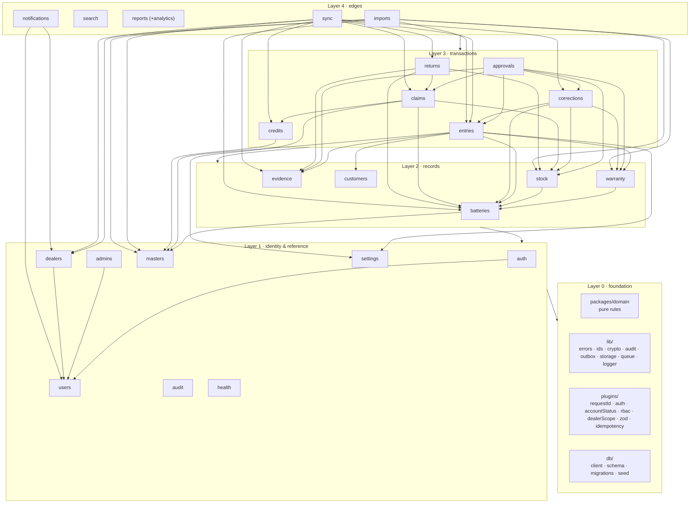

# Felix BMS — Backend Modules

Version 1.0 · 14 September 2026

`architecture.md` says *what* the system does; this file says **where each piece lives and what it owns**. Every backend feature belongs to exactly one module. A module is a folder under `backend/src/modules/<name>/` with the same five files, the same service conventions and a single-writer rule for its tables. Foundation code (shared domain package, `lib/`, `plugins/`, `db/`, `jobs/`) is described first because every module stands on it.

Use this file when you ask "where does this go?", "who is allowed to write this table?", "which screen calls this?" or "what do I need before I can build module X?".

---

## 1. Module map



**Dependency rules**

1. A module may call the `service.ts` of modules in its own layer or below. Never upward. Never another module's `repo.ts`.
2. Anything that must flow upward (for example "claim approved" → notifications) is an **outbox event**, not a call.
3. Read-only edge modules (`search`, `reports`, `audit`) own no business tables and may query any table through their own `readmodel.ts`, but they never write.
4. Tiny reference tables (`roles`, `settings`, masters) may be read by any module through the owner's dependency-free `read*` functions.
5. Cycles are a build error (`eslint-plugin-import/no-cycle` is on).

**Single-writer rule**: every table has exactly one module that inserts/updates it (§4). Other modules ask that module's `…InTx` function inside their transaction.

---

## 2. Conventions every module follows

**Naming update (16 Sep 2026):** each module's files are prefixed with the module name (`auth.routes.ts`, not bare `routes.ts`) and a `controller.ts` sits between `routes.ts` and `service.ts`, per the team's preferred layered style. `repo.ts` → `<name>.repository.ts`, `schemas.ts` → `<name>.validation.ts`. Everything else below (the `Ctx` shape, the transaction/audit/outbox rule, the layering/dependency rules in §1) is unchanged.

```
modules/<name>/
  <name>.routes.ts       Fastify route registration only: wires an HTTP path+method to a controller function. No parsing, no SQL, no rules. Declares { permission } per route.
  <name>.controller.ts   Parses the request (already Zod-validated by the route schema), calls the service, shapes the reply. Still thin — no business rules, no SQL.
  <name>.service.ts      Use-cases — the only place business rules run. Public functions come in pairs:
                            fn(ctx, input)              opens withTransaction() itself (used by routes, jobs)
                            fnInTx(tx, ctx, input)      composable version for other services (same transaction)
  <name>.repository.ts   SQL via drizzle. Every dealer-owned query takes ctx and applies dealer scope. Named columns only.
  <name>.validation.ts   Zod for params/query/body/response; imports shared payload schemas from @felix/domain.
  <name>.test.ts          Unit (service with fake repository) + integration (real Postgres) tests for this module.
  index.ts                export { register } — registers routes on the app with prefix '/api/v1'.
```

`ctx` is the same object everywhere:

```ts
type Ctx = {
  user: { id: string; scope: 'dealer' | 'admin'; role: string; dealerId?: string; permissions: Set<string> } | null;
  request: { id: string; ip: string; deviceId?: string; userAgent?: string; appVersion?: string };
  now: () => Date;          // injectable clock (Asia/Kolkata helpers in @felix/domain)
};
```

Every write service does, in one transaction: lock → rule check (`@felix/domain`) → writes → `audit(tx, …)` → `outbox(tx, …)` where anyone else needs to know.

---

## 3. Foundation

### F-1 `packages/domain` — pure business rules (shared with the app)

| File | Exports | Used by |
|---|---|---|
| `ids.ts` | `ID_FORMATS` (regex per kind), `isEntryRef()`, `isBatteryCode()`, `refParts()` | routes (param validation), sync, imports |
| `serials.ts` | `normalise(code)`, `deriveCode(code, rule)` → `{serialNo, mfgMonth}`, `checkFormat(code, rule)`, `nearDuplicate(a, b, distance)` | entries, batteries, imports, app capture screens |
| `warranty.ts` | `expiryFrom(start, months)`, `warrantyStatus(chain, today, thresholdDays)`, `remaining(chain, today)`, `usedFraction(chain, today)`, `canOverride(policy, days)` | warranty, claims, reports, app d31/d24 |
| `entryRules.ts` | `validateEntry(input, lookups, mode)` → `{ errors, warnings, exceptions }`; `ENTRY_ERRORS` catalogue with messages and `nextAction` | entries (submit/sync/approval), app review screen |
| `stock.ts` | `STOCK_STATES`, `TRANSITIONS`, `canTransition(from, to)`, `effectOf(entryType)` | stock, approvals, corrections, imports |
| `status.ts` | `ENTRY_TRANSITIONS`, `CLAIM_TRANSITIONS`, `DEALER_TRANSITIONS`, `USER_TRANSITIONS`, `assertTransition(machine, from, to, role)` | entries, approvals, claims, dealers, admins, app status chips |
| `dates.ts` | `todayKolkata(now)`, `toBusinessDate()`, `monthKey()`, `withinBackdateWindow()` | everything that touches a business date |
| `schemas/*.ts` | Zod payloads: `EntryCreate`, `EntryItemInput`, `SyncBatch`, `DealerRegister`, `ChallanCreate`, `ReportFilters`, `Decision` (`{reason}`) | routes + app forms |
| `index.ts` | barrel | |

No React, no Node built-ins, no I/O, no ambient clock. 95 % line coverage gate.

### F-2 `backend/src/lib` — cross-cutting helpers

| File | Exports | Notes |
|---|---|---|
| `errors.ts` | `AppError(code, status, message, {field, nextAction, details})`, `ERROR_CODES` | the only error type services throw |
| `ids.ts` | `uuidv7()`, `nextRef(tx, kind, period)` (counters table, atomic) | every module that numbers things |
| `crypto.ts` | `hashPassword/verifyPassword` (argon2id), `sha256`, `randomToken(bytes)`, `otpCode(len)`, `hashOtp` | auth |
| `audit.ts` | `audit(tx, {actor, action, entity, entityId, entityRef, before, after, reason, outcome})`, `auditDenied(ctx, …)` (no tx) | **sole writer of `audit_events`** |
| `outbox.ts` | `outbox(tx, eventType, aggregateType, aggregateId, payload)` | **sole writer of `outbox`** |
| `queue.ts` | `queues.otp / sms / email / push / exports / scan / reports`, `enqueue(queue, name, data, opts)` | BullMQ connections shared by API and worker |
| `storage.ts` | `presignPut(key, mime, size, ttl)`, `presignGet(key, ttl)`, `head(key)`, `putObject(key, stream)` | S3-compatible; **no delete function exists on purpose** |
| `sms.ts` `email.ts` `push.ts` | provider adapters behind `send(msg)`; `console` implementation for dev | called only from worker jobs |
| `pagination.ts` | `encodeCursor/decodeCursor`, `page(query, sortKeys)` | list endpoints |
| `logger.ts` | pino instance, `REDACT_PATHS` (unit-tested) | |
| `ratelimit.ts` | `limit(key, max, windowSec)` on Redis | auth, search, exports, sync |
| `cache.ts` | `cached(key, ttlSec, fn)`, `invalidate(key)` | accountStatus, masters, analytics |
| `pdf.ts` | `renderPdf(html)` | acknowledgement, challan, statement |
| `time.ts` | `nowKolkata()`, `formatLong/Short` | |

### F-3 `backend/src/plugins` — request pipeline (registered in this order)

| Plugin | Does | Fails with |
|---|---|---|
| `requestId` | reads/creates `X-Request-Id`, adds to logger and `ctx.request` | — |
| `errorHandler` | maps `AppError` → envelope; unknown → 500 + Sentry; Zod → 422 with field paths | — |
| `zod` + `openapi` | type provider, `/api/docs` (non-prod), response validation in test | — |
| `ratelimit` | route-level buckets from `config.rateLimit` | 429 `rate_limited` + `Retry-After` |
| `auth` | verifies JWT (current or previous secret), loads `ctx.user`; public routes opt out with `config.public` | 401 `unauthenticated` |
| `accountStatus` | user status + dealer status via `cache` (30 s), invalidated by users/dealers services | 403 `user_blocked` / `dealer_suspended` / `dealer_pending` |
| `rbac` | `route.config.permission` ∈ `ctx.user.permissions`; denied → `auditDenied` | 403 `permission_denied` |
| `dealerScope` | sets `ctx.dealerId` for dealer principals; strips `dealerId` from body/query; admins may pass `?dealerId` | — |
| `etag` | `ETag` on mutable resources, `If-Match` check | 412 `precondition_failed` |
| `idempotency` | `Idempotency-Key` → `idempotency_keys` (hash of body; replay returns stored response) | 409 `idempotency_mismatch` |

### F-4 `backend/src/db`

| Path | Content |
|---|---|
| `client.ts` | `pg` pool, drizzle instance, `withTransaction(fn)` (sets `SET LOCAL app.dealer_id`, `statement_timeout`), `advisoryLock(tx, key)` |
| `schema/masters.ts` `identity.ts` `batteries.ts` `entries.ts` `claims.ts` `stock.ts` `customers.ts` `evidence.ts` `sync.ts` `notifications.ts` `reports.ts` `imports.ts` `governance.ts` | drizzle table definitions, one file per table group (matches `architecture.md §8.3`) |
| `migrations/NNNN_*.sql` | forward-only; each append-only table gets its `forbid_change` trigger in the migration that creates it |
| `seed/masters.ts` | cities, models, serial rules, entry types (with `stock_effect`/`warranty_effect`), reason + fault codes, locations, policy v1, roles, templates — idempotent, all environments |
| `seed/main-admin.ts` | first `main_admin` from `SEED_MAIN_ADMIN_EMAIL/NAME`; password reset link printed once |
| `seed/demo.ts` | the data in `memory.md §10` — never production |
| `seed/volume.ts` | 500k-battery generator for AC-10 (Phase 4) |

### F-5 `backend/src/jobs` — worker process

Each job file exports `{ name, schedule?, handler }` and calls one module service; no rules live in jobs.

| Job | Schedule | Calls |
|---|---|---|
| `notificationsDispatch` | every 2 s | `notifications.dispatchOutbox()` |
| `sms` `email` `push` `otp` | queue | `notifications.deliver(channel, id)` / `auth` OTP send |
| `evidenceScan` | queue | `evidence.scan(assetId)` |
| `exports` | queue | `reports.runExport(jobId)` |
| `scheduledReports` | every minute | `reports.runDueSchedules()` |
| `warrantyExpiring` | 06:00 IST | `warranty.notifyExpiring()` |
| `lowStock` | 06:10 IST + after movements | `stock.raiseLowStockAlerts()` |
| `syncReconcile` | 06:20 IST | `sync.reconcile()` |
| `retention` | 02:30 IST | `settings.retentionRun()` |
| `backup` | 02:00 IST | `health.backup()` (pg_dump → storage) + weekly restore drill |
| `healthDigest` | 08:00 IST | `health.digest()` |

---

## 4. Table ownership (single writer)

| Table | Owner (only writer) | Other writers allowed via | Readers |
|---|---|---|---|
| `cities` `battery_models` `serial_rules` `entry_types` `reason_codes` `inventory_locations` `credit_rates` | masters | — | all (read functions) |
| `settings` | settings | — | all |
| `dealers` | dealers | — | users, auth, entries, sync, notifications, reports |
| `users` `user_permissions` | users | admins → `users.createAdminInTx`, dealers → `users.createDealerUserInTx` | auth, plugins, notifications |
| `roles` | admins | — | users |
| `sessions` `otp_challenges` `login_attempts` | auth | — | admins (activity) |
| `batteries` `battery_events` `replacement_links` | batteries | stock → `batteries.applyMovementInTx`; approvals → `resolveOrCreateInTx`, `linkReplacementInTx` | everyone |
| `warranty_policies` `warranty_chains` `warranty_overrides` | warranty | approvals → `createChainInTx`, `inheritChainInTx` | batteries, claims, reports |
| `stock_movements` `stock_alerts` | stock | approvals/returns/corrections/imports → `postMovementInTx` | reports |
| `evidence_assets` | evidence | — | entries, claims, returns, imports |
| `customers` | customers | entries → `linkOrCreateInTx` | reports |
| `entries` `entry_items` `exceptions` | entries | approvals/corrections/sync/imports → `createInTx`, `setStatusInTx`, `resolveExceptionInTx` | everyone |
| `corrections` | corrections | approvals → `requestInTx` | entries (detail) |
| `warranty_claims` | claims | approvals → `createForItemInTx`; returns → `markReceivedInTx`, `markDispatchedInTx` | credits, reports, sync |
| `credit_notes` | credits | claims → `issueInTx` | reports, sync |
| `challans` `challan_lines` | returns | sync → `dispatchInTx` | claims, reports |
| `sync_jobs` `idempotency_keys` | sync / plugin `idempotency` | — | health |
| `notification_templates` `notifications` `announcements` `push_tokens` | notifications | — | sync (changes feed) |
| `outbox` | `lib/outbox` (insert) · notifications (marks published) | — | — |
| `saved_reports` `export_jobs` | reports | — | — |
| `imports` `import_rows` | imports | — | — |
| `audit_events` | `lib/audit` | — | audit |
| `counters` | `lib/ids` | — | — |

---

## 5. Modules

Template per module: purpose · location · owns/reads · domain functions · endpoints · service API · events · jobs · dependencies · errors · tests · screens served · phase items.

---

### M-01 `health` — liveness, readiness, metrics, system status

**Purpose.** Tell load balancers and admins whether the system works.
**Location.** `modules/health/{routes,service,metrics}.ts`
**Owns.** nothing. **Reads.** `sync_jobs`, `export_jobs`, queue stats, last backup marker in storage.

| Endpoint | Permission | Returns |
|---|---|---|
| `GET /health` | public | `{ok:true, version}` |
| `GET /ready` | public | 200 only if DB `select 1`, Redis ping, storage HEAD bucket, migrations current |
| `GET /metrics` | network-restricted | Prometheus text |
| `GET /system/status` | `settings.manage` | queues (depth/failed), failed syncs today, last backup, last restore drill, provider health |

**Service.** `ready()`, `status()`, `backup()` (pg_dump stream → `felix-backups/YYYY/MM/DD.dump`), `restoreDrill()`, `digest()`.
**Jobs.** `backup`, `healthDigest`. **Phase.** P0-04, P4-04…P4-06. **Screens.** admin Settings & sync → System health.

---

### M-02 `auth` — OTP, passwords, tokens, sessions

**Purpose.** Prove who is calling; issue and rotate tokens; never leak whether an identifier exists.
**Location.** `modules/auth/{routes,service,repo,schemas,otp.ts,tokens.ts}`
**Owns.** `sessions`, `otp_challenges`, `login_attempts`. **Reads.** `users`, `dealers` (status), `roles`.
**Domain.** none (auth has no business rules). **Lib.** `crypto`, `ratelimit`, `queue.otp`.

| Endpoint | Permission | Notes |
|---|---|---|
| `POST /auth/otp/request` | public | `{target, purpose, deviceId}` → `{challengeId, resendAfter}`; same response whether or not the target exists |
| `POST /auth/otp/verify` | public | login → tokens; register/reset/verify_mobile → `{verifiedToken}` (10 min, single use) |
| `POST /auth/login` | public | email + password → `202 {challengeId}` (2FA) |
| `POST /auth/refresh` | public (refresh token) | rotation; reuse → revoke family, 401 `token_reused` |
| `POST /auth/logout` | any | revokes current session |
| `GET /auth/sessions` · `DELETE /auth/sessions/{id}` | any | device list / revoke |
| `POST /auth/password/forgot` · `/reset` · `/change` | public / public (verifiedToken) / any | reset revokes all sessions |

**Service API.**

| Function | Tx | Does | Called by |
|---|---|---|---|
| `requestOtp(ctx, {target, purpose})` | own | rate limit; create challenge (hash); enqueue `otp` job (SMS or email); audit `auth.otp_requested` | routes, dealers.register (verify_mobile) |
| `verifyOtp(ctx, {challengeId, code, deviceId})` | own | attempts++, compare hash, consume; on login: `issueTokens` | routes |
| `loginWithPassword(ctx, {email, password})` | own | verify argon2; `login_attempts`; lock after 10 failures/15 min; create 2FA challenge | routes |
| `issueTokens(tx, user, deviceId)` | in | JWT (15 min) + refresh (hash stored in `sessions`, family id) | verifyOtp |
| `refresh(ctx, token)` | own | find by hash; if revoked → revoke family; else rotate | routes |
| `revokeAllForUser(tx, userId, reason)` | in | used on password reset, status change, admin "reset access" | users, admins, dealers |
| `forgot/reset/changePassword` | own | reset needs `verifiedToken`; change needs current password | routes |

**Emits.** none (OTP goes straight to the `otp` queue — no business transaction to protect). **Audit.** `auth.signed_in`, `auth.otp_failed`, `auth.locked`, `auth.refresh_reused`, `auth.password_changed`.
**Depends on.** users, dealers. **Used by.** plugins/auth (verify), dealers (verify_mobile).
**Errors.** `invalid_otp`, `otp_expired`, `too_many_attempts`, `invalid_credentials`, `account_locked`, `token_reused`, `token_expired`, `verified_token_invalid`.
**Tests.** OTP lifecycle, lock-out, refresh rotation/reuse family revocation, same-response-for-unknown-target, rate limits; scenario AC-01 (login step).
**Screens.** dealer d02 (sign in), d03 (reset), d04 (verify mobile); admin Sign in / Forgot password. **Phase.** P1-03, P1-04, P1-05.

---

### M-03 `users` — people: profile, preferences, dealer staff

**Purpose.** One `users` table for dealer staff and head office; effective permissions; `/me`.
**Location.** `modules/users/{routes,service,repo,schemas,permissions.ts}`
**Owns.** `users`, `user_permissions`. **Reads.** `roles`, `dealers`.
**Domain.** `status.ts` (`USER_TRANSITIONS`).

| Endpoint | Permission | Notes |
|---|---|---|
| `GET /me` | any | user, dealer (if any), effective permissions, feature flags |
| `PATCH /me` | any | `name`, `language`, `smsAlerts` |
| `GET /dealers/{id}/staff` · `POST` · `PATCH /{userId}` · `POST /{userId}/status` | `dealers.staff.manage` (admins any dealer; `dealer_manager` own dealer only) | invite creates user + OTP-based first sign-in; status with reason |

**Service API.** `getMe`, `updatePreferences`, `listStaff`, `inviteStaff`, `updateStaff`, `setStaffStatus` (→ `auth.revokeAllForUser`, cache invalidate), `effectivePermissions(userId)` (template ∪ grants − revokes; cached 30 s), internal `createDealerUserInTx`, `createAdminInTx`, `findByIdentifier`, `setStatusInTx`.
**Emits.** `user.status_changed` (in-app to the person, SMS if dealer). **Audit.** `user.created/updated/status_changed/permission_granted/permission_revoked`.
**Depends on.** auth (revoke), lib/cache. **Used by.** auth, admins, dealers, plugins/accountStatus, notifications (recipients).
**Errors.** `identifier_taken`, `grant_exceeds_grantor`, `cannot_change_own_role`, `invalid_transition`.
**Tests.** effective permissions maths, grantor bound, own-role change refused, dealer_manager cross-dealer 404.
**Screens.** dealer d09 (profile), admin Dealer profile → Staff. **Phase.** P1-02, P1-10.

---

### M-04 `admins` — admin accounts, roles, hierarchy

**Purpose.** Main-Admin-only control centre (PRD §18–19). Prevents privilege escalation.
**Location.** `modules/admins/{routes,service,repo,schemas,escalation.ts}`
**Owns.** `roles`. Writes admin users through `users.createAdminInTx` / `users.setStatusInTx`.

| Endpoint | Permission | Notes |
|---|---|---|
| `GET /admins` · `POST` · `GET /{id}` · `PATCH /{id}` | `admins.manage` (main_admin only) | list with last login, created, status |
| `POST /admins/{id}/status` | `admins.manage` | active / temporarily_blocked / inactive / soft_deleted + reason |
| `POST /admins/{id}/reset-access` | `admins.manage` | revoke sessions, send reset OTP |
| `GET /admins/{id}/activity` | `admins.manage` | sign-ins + audit summary |
| `GET /roles` · `POST` · `PATCH /{key}` | `admins.manage` | templates; `system` roles cannot lose escalation locks |

**Service API.** `list`, `create` (role ≠ main_admin unless caller is main_admin; never more than caller holds), `update`, `setStatus`, `resetAccess`, `activity`, `roles.*`; `escalation.assertCanGrant(grantor, targetRole, permissions)`.
**Audit.** `admin.created/updated/blocked/unblocked/deactivated/soft_deleted/restored/access_reset`, `role.updated`. Denied attempts by co_admin are audited by the rbac plugin.
**Depends on.** users, auth. **Used by.** — (users reads `roles`).
**Errors.** `escalation_denied`, `main_admin_protected`, `last_main_admin`.
**Tests.** INV-permissions (co_admin 403 + audited; grantor bound; cannot delete last main admin; soft-deleted admin's past actions still visible).
**Screens.** admin Admin users & roles. **Phase.** P1-11.

---

### M-05 `dealers` — registration, lifecycle, profile, documents

**Purpose.** The gate for every submission (PRD §7). Self-registration; admin activation; suspension without loss of history.
**Location.** `modules/dealers/{routes,service,repo,schemas,codes.ts}`
**Owns.** `dealers`. **Reads.** `users`, `entries` (summary counts via entries read fn), `evidence_assets` (documents).
**Domain.** `status.ts` (`DEALER_TRANSITIONS`).

| Endpoint | Permission | Notes |
|---|---|---|
| `POST /dealers/register` | public + `verifiedToken` (mobile) | creates dealer `pending_approval` + first `dealer_manager` user; duplicate mobile/email → 409 with flags for admins |
| `GET /dealers/me` · `PATCH /dealers/me` · `POST /dealers/me/documents` | dealer | editable: contact, email, address, place; locked: name, city, code |
| `GET /dealers` · `GET /{id}` · `PATCH /{id}` | `dealers.read` / `dealers.edit` | admin edits of locked fields are audited with before/after |
| `POST /dealers/{id}/approve` `{dealerCode, reason}` · `/reject` · `/suspend` · `/activate` | `dealers.approve` / `dealers.suspend` | code validated & unique; invalidates status cache |
| `GET /dealers/{id}/summary` | `dealers.read` | batteries, replacements, waiting entries, old batteries at shop, credits this month |
| `GET /dealers/{id}/suggest-code` | `dealers.approve` | `codes.suggest(name)` |

**Service API.** `register`, `approve`, `reject`, `suspend`, `activate`, `updateProfile`, `adminUpdate`, `summary`, `isActive(dealerId)` (cached, used by accountStatus), `addDocument`, `listForBootstrap`.
**Emits.** `dealer.registered` (→ admins), `dealer.status_changed` (→ dealer users: in-app + SMS). **Audit.** `dealer.registered/approved/rejected/suspended/activated/updated/document_added`.
**Depends on.** users, auth (verify_mobile token), evidence, lib/cache. **Used by.** plugins/accountStatus, sync (bootstrap), notifications (audience), reports.
**Errors.** `mobile_taken`, `email_taken`, `dealer_code_taken`, `dealer_code_invalid`, `dealer_code_immutable`, `invalid_transition`, `field_locked`.
**Tests.** AC-01, INV-status-every-request, duplicate flags, code immutability.
**Screens.** dealer d04, d05, d06; admin New dealers, Dealers, Dealer profile. **Phase.** P1-07, P1-08, P1-09.

---

### M-06 `masters` — reference data the whole system agrees on

**Purpose.** Models, entry types (with stock/warranty effects and evidence rules), cities, reason/fault codes, serial rules, locations, credit rates. Retire, never delete.
**Location.** `modules/masters/{routes,service,repo,schemas}` + `db/seed/masters.ts`
**Owns.** all master tables (§4).

| Endpoint | Permission | Notes |
|---|---|---|
| `GET /masters` | any | one bundle with `ETag`; dealers get only `dealer_visible` entry types and no credit rates unless `credits.read` |
| `GET/POST/PATCH /masters/models` · `/entry-types` · `/cities` · `/reason-codes` · `/serial-rules` · `/locations` · `/credit-rates` | `masters.manage` | `active:false` retires; `DELETE` does not exist |

**Service API.** `bundle(ctx)` (cached 60 s, per scope), `model(id)`, `entryType(id)`, `serialRuleFor(family)`, `creditRate(modelId, date)`, `faultCodes()`, `upsert*`, `retire*`.
**Audit.** `master.updated` with before/after. **Emits.** `masters.changed` (bootstrap ETag bump).
**Depends on.** nothing. **Used by.** everyone.
**Errors.** `model_in_use_cannot_rename`, `entry_type_locked` (system types keep their effects).
**Screens.** dealer d10, d11, d13 (types, fault chips, model picker); admin Models & serial rules, Settings → Reference lists. **Phase.** P1-01, P1-12.

---

### M-07 `settings` — runtime configuration and retention

**Location.** `modules/settings/{routes,service,repo}`. **Owns.** `settings`.
**Endpoints.** `GET /settings` (`settings.manage`; masked secrets), `PUT /settings` (validated per key, audited).
**Keys.** `backdate_window_days` (30), `claim_decision_mode` (`after_inspection`), `near_duplicate_distance` (1), `evidence_required_at_approval` (false), `export_link_ttl_hours` (24), `customer_retention_years` (5), `low_stock_alert_hours` (24).
**Service API.** `get(key)` (cached 30 s), `set(key, value, reason)`, `retentionRun()` (job: purge idempotency keys, OTPs, login attempts, expire export links, customer retention per D-06).
**Screens.** admin Settings & sync. **Phase.** P1-12, P4-08.

---

### M-08 `audit` — the read side of the audit trail

**Purpose.** Filterable, redacted view of `audit_events`; export. Writing happens only through `lib/audit`.
**Location.** `modules/audit/{routes,service,readmodel,redact.ts}`
**Endpoints.** `GET /audit` (`audit.read`; filters actor, action, entityType, entityId, date range, outcome; cursor), `GET /audit/export` (`audit.read`, async via reports job, XLSX), `GET /entries/{id}/audit` (registered here; dealers see their own entry's events with actor names reduced to "Head office").
**Redaction.** non-`main_admin` viewers never see mobiles/emails in before/after; customer names masked for `read_only`.
**Depends on.** reports (export runner). **Screens.** admin Audit log; entry detail history; dealer d19 history. **Phase.** P1-13.

---

### M-09 `batteries` — the battery register and chain structure

**Purpose.** One row per physical battery; its state, custody, chain membership and timeline. Chain *links* live here; chain *cover* lives in warranty.
**Location.** `modules/batteries/{routes,service,repo,schemas,lookup.ts,timeline.ts}`
**Owns.** `batteries`, `battery_events`, `replacement_links`. **Reads.** `warranty_chains` (via warranty), `entries` (related), `stock_movements` (via stock read fn), `customers`.
**Domain.** `serials.ts`.

| Endpoint | Permission | Notes |
|---|---|---|
| `GET /batteries` | `batteries.read` (dealer: own) | filter model §13.1 subset; cursor |
| `GET /batteries/{code}` | `batteries.read` | detail: battery, warranty summary, chain, events, related entries, movements, claims, evidence count |
| `GET /batteries/{code}/chain` | `batteries.read` | ordered links with cover summary and repeat flag |
| `GET /batteries/lookup?code=` | `entries.create` | capture-time lookup: `{found, model, mfgMonth, custody:'yours'|'other'|'customer', cover:{start,expiry,status}}` — never reveals the other dealer |

**Service API.** `findByCode(tx?, code)`, `lookup(ctx, code)`, `list`, `detail`, `chain(code)` (walks `replaced_from_id` to root, then `replaced_by_id` forward), `resolveOrCreateInTx(tx, ctx, {code, entered, serial, modelId, mfgMonth, dealerId, origin})`, `linkReplacementInTx(tx, ctx, {item, old, new, chain, date})` (sets `replaced_by/from`), `applyMovementInTx(tx, batteryId, {state, custodian, dealerId, locationId, customerId})` (called only by stock), `recordEventInTx(tx, batteryId, type, refs, details)`, `markNotOnRecordInTx`.
**Audit.** `battery.created/imported/linked`. **Emits.** none.
**Depends on.** masters, warranty (read), stock (read for detail). **Used by.** entries, approvals, corrections, stock, claims, returns, imports, search, reports.
**Errors.** `battery_not_found`, `battery_already_replaced`, `chain_broken` (data problem, alerts admins).
**Tests.** chain walk both directions, cycle guard, leading zeros round-trip, lookup custody masking; AC-04.
**Screens.** dealer d11 (old battery lookup), d13 (new battery), d24 (battery detail); admin Battery search, Battery detail. **Phase.** P2-01, P2-13.

---

### M-10 `warranty` — policies, chains, overrides, continuity

**Purpose.** The engine behind invariant I-1. Computes; never accepts a typed expiry.
**Location.** `modules/warranty/{routes,service,repo,schemas,engine.ts,continuity.ts}`
**Owns.** `warranty_policies`, `warranty_chains`, `warranty_overrides`.
**Domain.** `warranty.ts`.

| Endpoint | Permission | Notes |
|---|---|---|
| `GET /warranty/policies` | `warranty.read` | versions with in-force marker |
| `POST /warranty/policies` | `warranty.policy.manage` (main_admin) | publish new version (`effective_from ≥ today`, reason) |
| `GET /warranty/overrides` | `warranty.read` | queue + history |
| `POST /batteries/{code}/overrides` | `warranty.override.request` | `{days, reason, evidenceIds}` |
| `POST /warranty/overrides/{id}/approve` · `/reject` | `warranty.override.approve` | policy checks; before/after in audit |
| `GET /warranty/continuity` | `warranty.read` | chains with >1 replacement, extended-by-replacement (must be 0), refused writes, approved overrides |
| `GET /warranty/expiring?days=` | `warranty.read` (dealer: own) | list for alerts and the dealer's "cover ending soon" |

**Service API.** `policyEffective(date)`, `publishPolicy`, `createChainInTx(tx, ctx, {rootBatteryId, anchorDate, policy})`, `inheritChainInTx(tx, ctx, {chainId, newBatteryId})` (count++, repeat flag), `statusOf(chain, today)`, `summaryFor(batteryId)` (used by batteries/claims/entries payloads), `requestOverride`, `decideOverride`, `continuityReport`, `expiringWithin(days)`, `notifyExpiring()` (job), `reverseInheritInTx` (corrections/void).
**Emits.** `override.requested` (→ main admins), `override.decided` (→ requester/dealer), `policy.published` (→ admins), `warranty.expiring` (job, per dealer).
**Audit.** `policy.published`, `override.requested/approved/rejected` (with `old_expiry → new_expiry`), `chain.created/inherited`.
**Depends on.** batteries, masters, settings. **Used by.** approvals, entries (validation lookups), claims, reports, sync.
**Errors.** `expiry_not_writable` (400 whenever a client sends any expiry field), `policy_not_effective_yet`, `override_not_allowed_by_policy`, `override_exceeds_max`, `chain_missing`.
**Tests.** INV-warranty-never-restarts (2nd and 3rd replacement), `expiryFrom` clamps, policy versioning leaves old chains alone, override bounds, AC-06 rejects typed expiry.
**Screens.** dealer d31 (carry-over), d24, home alert; admin Warranty (4 tabs). **Phase.** P3-01…P3-04.

---

### M-11 `stock` — the movement ledger

**Purpose.** Immutable ledger; derived positions; transitions enforced; reorder alerts.
**Location.** `modules/stock/{routes,service,repo,schemas,positions.ts,alerts.ts}`
**Owns.** `stock_movements`, `stock_alerts`. **Reads.** `batteries`, `battery_models` (thresholds).
**Domain.** `stock.ts`.

| Endpoint | Permission | Notes |
|---|---|---|
| `GET /stock/positions?by=dealer|model|state|location` | `stock.read` (dealer: own) | derived from `batteries` current state |
| `GET /stock/movements` | `stock.read` | ledger with filters |
| `POST /stock/movements` | `stock.post` | `{batteryCode, toState, toDealerId?, toLocationId?, reasonCodeId, reasonText}` |
| `GET /stock/thresholds` · `PUT` | `stock.thresholds` | writes `battery_models.reorder_threshold` via masters |
| `GET /stock/alerts` · `POST /stock/alerts/{id}/ack` | `stock.read` / `stock.thresholds` | acknowledgement audited |

**Service API.** `postMovementInTx(tx, ctx, {batteryId, toState, toCustodian, toDealerId, toLocationId, entryId, claimId, challanId, reasonCodeId, reasonText, correctionOfId})` → validates `canTransition`, inserts ledger row, `batteries.applyMovementInTx`, `battery_events`; `postMovement` (own tx, audited), `positions`, `ledger`, `raiseLowStockAlerts()` (job + after movement, debounced by `low_stock_alert_hours`), `ack`.
**Emits.** `stock.low` (→ dealer + admins). **Audit.** `stock.movement_posted`, `stock.threshold_changed`, `stock.alert_acknowledged`.
**Depends on.** batteries, masters. **Used by.** approvals, corrections, returns, claims (disposition), imports, reports.
**Errors.** `invalid_transition`, `scrap_is_terminal`, `reason_required`, `battery_not_found`.
**Tests.** transition table exhaustive, positions equal ledger replay, alert debounce.
**Screens.** admin Stock (4 tabs); dealer stock views (Phase 5). **Phase.** P2-01 (structure), P3-09.

---

### M-12 `evidence` — photos, signatures, documents

**Purpose.** Private, never-overwritten assets with scoped, short-lived access.
**Location.** `modules/evidence/{routes,service,repo,schemas,scan.ts}`
**Owns.** `evidence_assets`.

| Endpoint | Permission | Notes |
|---|---|---|
| `POST /evidence/presign` | `evidence.upload` | mime/size rules; returns `assetId` + PUT URL (10 min) |
| `POST /evidence/{id}/confirm` | `evidence.upload` | HEAD, size/sha check, status `uploaded`, enqueue scan |
| `GET /evidence/{id}/url?variant=full|thumb` | `evidence.read` | scope resolved through the owning record; GET URL (5 min) |

**Service API.** `presign`, `confirm`, `signedUrl` (resolves owner: entry/claim/challan/dealer/customer → scope check), `attachToEntryInTx(tx, entryId, assetIds, itemMap)`, `requiredKindsFor(entryTypeId)` (from masters `evidence_rules`), `missingRequired(entry)`, `storeGenerated(kind, stream, refs)` (PDFs, exports), `scan(assetId)` (job: EXIF strip, thumbnail, optional ClamAV → `scanned`/`quarantined`).
**Audit.** `evidence.confirmed`, `evidence.quarantined`. **Emits.** `evidence.quarantined` (→ admins).
**Depends on.** lib/storage, masters. **Used by.** entries, dealers, claims, returns, corrections, imports, reports, customers (documents later).
**Errors.** `unsupported_media`, `file_too_large`, `upload_not_found`, `checksum_mismatch`, `asset_quarantined`.
**Tests.** presign constraints, confirm size mismatch, cross-dealer URL → 404, thumbnail generated.
**Screens.** dealer d04/d06 (documents), d11/d13/d15 (photos, signature); admin entry detail, registrations documents. **Phase.** P2-10…P2-12.

---

### M-13 `customers` — customer profiles and service history

**Location.** `modules/customers/{routes,service,repo,schemas}`. **Owns.** `customers`.
**Endpoints.** `GET /customers` (dealer own / `customers.read`), `POST` (duplicate mobile → 409 with existing id), `GET /{id}`, `PATCH /{id}` (ETag), `POST /{id}/merge {intoId, reason}` (`customers.merge`; sets `merged_into_id`, both readable), `GET /{id}/history` (entries + batteries).
**Service API.** `list`, `create`, `update`, `merge`, `history`, `linkOrCreateInTx(tx, ctx, dealerId, {name, mobile?})` (entries with a customer name), `retentionSweep()` (settings job, per D-06).
**Audit.** `customer.created/updated/merged`. **Depends on.** entries (read), batteries (read). **Errors.** `duplicate_customer`, `merge_target_invalid`.
**Screens.** admin Customers; dealer "Customer" field on d11. **Phase.** P2-15, P5-02.

---

### M-14 `entries` — the transaction header and its items

**Purpose.** Create, validate, list and show entries; own the exception rows raised at creation; number references; enforce idempotency for dealer submissions.
**Location.** `modules/entries/{routes,service,repo,schemas,validate.ts,create.ts,pdf.ts}`
**Owns.** `entries`, `entry_items`, `exceptions`. **Reads.** batteries, warranty (chain status), masters, settings, evidence, customers, claims (summary in detail), corrections (detail), audit (detail).
**Domain.** `entryRules.ts`, `serials.ts`, `dates.ts`, `status.ts`.

| Endpoint | Permission | Notes |
|---|---|---|
| `POST /entries` | `entries.create` | body `EntryCreate` (+ `clientKey` for dealers; admins may pass `dealerId`, `status:'draft'`); returns `EntryDetail`; 422 field errors; `exception` status when routed |
| `POST /entries/validate` | `entries.create` | dry run: `{errors, warnings, exceptions}` — the review screen calls it when online |
| `GET /entries` | `entries.read` | filter model §13.1, cursor, dealer scope |
| `GET /entries/{idOrRef}` | `entries.read` | `EntryDetail`: header, items (+ resolved battery/cover), evidence (thumb URLs), claim summary, corrections, exceptions, audit |
| `PATCH /entries/{id}` · `POST /entries/{id}/submit` | `entries.create` (admin drafts only) | draft editing |
| `POST /entries/{id}/handover` · `/cover-told` | `entries.create` (own) | post-submission facts |
| `POST /entries/{id}/evidence/attach` | `evidence.upload` | late media from the offline queue |
| `GET /entries/{id}/acknowledgement.pdf` | `entries.read` | ref, dealer, items, totals, timestamp |
| `GET /entries/{id}/audit` | see audit module | |

**Service API.**

| Function | Tx | Does | Called by |
|---|---|---|---|
| `create(ctx, input)` | own | idempotency (`dealer_id + client_key` / header); `lookups()` (batteries, chains, open requests, masters, settings); `validateEntry(mode)`; errors → 422; `nextRef`; insert header+items (+ `customers.linkOrCreateInTx`); exceptions → `exception` status + rows; `evidence.attachToEntryInTx`; audit `entry.submitted`; outbox `entry.submitted` | routes |
| `createInTx(tx, ctx, input, source)` | in | same without opening a tx | sync, corrections, imports |
| `validate(ctx, input, mode)` | own (read) | dry run | routes, sync (pre-check) |
| `list`, `get` | — | dealer scope, ETag on get | routes, sync changes |
| `updateDraft`, `submitDraft` | own | admin drafts only | routes |
| `recordHandover`, `recordCoverTold`, `attachEvidence` | own | audited facts | routes, sync |
| `lockInTx(tx, id)` | in | `FOR UPDATE` header + items | approvals, corrections |
| `setStatusInTx(tx, ctx, id, next, {reason, decidedBy})` | in | `assertTransition`; audit | approvals, corrections |
| `resolveExceptionInTx(tx, ctx, exceptionId, resolution)` | in | override/corrected/rejected | approvals |
| `recomputeTotalInTx` | in | `total_qty = count(items)` | create, corrections |
| `acknowledgementPdf` | — | via lib/pdf + evidence.storeGenerated | routes |

**Emits.** `entry.submitted` (→ dealer receipt + admin queue count), `entry.exception` (→ dealer + admins). **Audit.** `entry.submitted`, `entry.draft_saved`, `entry.handover_recorded`, `entry.cover_told`, `entry.evidence_attached`, `exception.raised`.
**Depends on.** batteries, warranty, masters, settings, evidence, customers. **Used by.** approvals, corrections, sync, imports, claims (read), reports/search (read models).
**Errors.** all `ENTRY_ERRORS` from the domain (`duplicate_serial`, `old_equals_new`, `old_not_on_record` (exception), `custody_conflict`, `warranty_expired`, `already_replaced`, `format_mismatch`, `date_out_of_window`, `model_inactive`, `remark_required`, `month_invalid`, `quantity_mismatch`), plus `idempotent_replay` (200), `idempotency_mismatch` (409), `dealer_not_active`, `entry_immutable`.
**Tests.** every rule row; AC-02, AC-03, AC-05 (block path), AC-08 (original untouched), INV-leading-zeros, replay same ref, 422 field paths match the app's keys.
**Screens.** dealer d10–d17 (capture, review, sent), d18, d19; admin All entries, Entry detail, Record an entry. **Phase.** P2-01, P2-02, P2-04, P2-05, P2-09.

---

### M-15 `approvals` — head-office decisions and the exception queue

**Purpose.** Review, approve, refuse, void; resolve exceptions. Owns the approval transaction (`architecture.md §9.4`).
**Location.** `modules/approvals/{routes,service,repo,schemas,approve.ts,exceptions.ts}`
**Owns.** nothing (orchestrates). **Reads/writes via.** entries, batteries, warranty, stock, claims, evidence, corrections, masters, settings.

| Endpoint | Permission | Notes |
|---|---|---|
| `POST /entries/{id}/review` | `entries.review` | `submitted → under_review` |
| `POST /entries/{id}/approve` | `entries.approve` | the transaction; 422 `cannot_approve_yet` with the blocking list |
| `POST /entries/{id}/reject` | `entries.reject` | status + reason + notification |
| `POST /entries/{id}/void` | `entries.void` | compensations if approved |
| `GET /exceptions` | `entries.exceptions.resolve` | queue with codes, dealer, serials, age |
| `POST /exceptions/{id}/override` · `/reject` · `/request-correction` | `entries.exceptions.resolve` | override re-validates with `overrides:[code]`; all reasoned |
| `GET /approvals/queue` | `entries.read` | counts by bucket for dashboards (cached 30 s) |

**Service API.** `review`, `approve(ctx, id, reason)` → `approve.ts` steps 1–6 (locks in fixed order; `entries.setStatusInTx`; per item `batteries.resolveOrCreateInTx`, `warranty.createChainInTx | inheritChainInTx`, `batteries.linkReplacementInTx`, `stock.postMovementInTx` ×n, `claims.createForItemInTx`; `evidence.missingRequired` if setting; outbox), `reject`, `voidEntry` (compensating movements, `warranty.reverseInheritInTx`, link marked reversed), `listExceptions`, `overrideException`, `rejectException`, `requestCorrection` (→ corrections), `queueCounts`.
**Emits.** `entry.approved`, `entry.rejected`, `entry.voided`, `exception.overridden`. **Audit.** `entry.reviewed/approved/rejected/voided`, `exception.overridden/rejected`.
**Depends on.** entries, batteries, warranty, stock, claims, evidence, corrections, masters, settings. **Used by.** — (routes, sync never approves).
**Errors.** `cannot_approve_yet`, `invalid_transition`, `offline_mode` (admin decisions refused while the setting `maintenance.readonly` is on), `exception_unresolved`.
**Tests.** approval effects (batteries, links, chain, movements, claim) in one transaction and rolled back together on failure; AC-05 override path; void compensations; INV-warranty-never-restarts via approvals.
**Screens.** admin Requests to approve, Entry detail actions, Exceptions (inside approvals screen), Dashboard queue. **Phase.** P2-06, P2-07, P3-02.

---

### M-16 `corrections` — audited change after submission

**Purpose.** Requests from dealers/admins; admin applies as a linked entry or declines.
**Location.** `modules/corrections/{routes,service,repo,schemas,apply.ts}`
**Owns.** `corrections`.

| Endpoint | Permission | Notes |
|---|---|---|
| `POST /entries/{id}/corrections` | `corrections.request` (dealer own) | `{changes, reason}` |
| `GET /corrections` | `corrections.decide` | pending first |
| `POST /corrections/{id}/apply` | `corrections.decide` | `{changes: {customer?, remarks?, items:[{code?, oldCode?}]}, reason}` |
| `POST /corrections/{id}/decline` | `corrections.decide` | reason |
| `POST /entries/{id}/correct` | `corrections.decide` | admin-initiated apply without a request |

**Service API.** `request`, `requestInTx` (approvals, sync), `list`, `apply` (diff → if nothing changed 422 `no_change`; `entries.createInTx` with `ref = <orig>-C<n>`, `linked_to_id`; status `submitted` if original not approved else `corrected` with `stock.postMovementInTx` compensations, `warranty.reverseInheritInTx` + re-inherit, `batteries.linkReplacementInTx` re-link; original → `corrected`; audit with old→new list), `decline`.
**Emits.** `correction.requested` (→ admins), `correction.decided` (→ dealer). **Audit.** `correction.requested/applied/declined`.
**Depends on.** entries, stock, warranty, batteries. **Used by.** approvals, sync.
**Errors.** `no_change`, `correction_pending_exists`, `entry_not_correctable` (draft/cancelled).
**Tests.** AC-08; corrected-after-approval compensations; re-queue when not yet approved.
**Screens.** dealer d19 ("Ask head office to fix it"); admin Correction requests, Entry detail "Correct it". **Phase.** P2-08.

---

### M-17 `claims` — the commercial warranty decision

**Purpose.** One claim per replacement item; accepted on paperwork; decided after inspection (or on approval, per setting).
**Location.** `modules/claims/{routes,service,repo,schemas,decide.ts}`
**Owns.** `warranty_claims`.
**Domain.** `status.ts` (`CLAIM_TRANSITIONS`).

| Endpoint | Permission | Notes |
|---|---|---|
| `GET /claims` · `GET /claims/{idOrRef}` | `claims.read` (dealer own) | detail: entry/item, chain cover, old/new, finding, decision, credit note, return stage |
| `POST /claims/{id}/accept` · `/refuse-upfront` | `claims.accept` | before/after inspection gate |
| `POST /claims/{id}/check` | `claims.decide` | `{findingCode, conditionNote, disposition, evidenceIds}` → `stock.postMovementInTx` (repair/scrap/hold) |
| `POST /claims/{id}/decide` | `claims.decide` | `{outcome:'approved'|'refused', reason, creditAmount?, creditReason?}` → `credits.issueInTx` on approval |
| `GET /claims/summary` | `claims.read` | counts + rupees this month (dealer home, admin dashboard) |

**Service API.** `createForItemInTx(tx, ctx, {entry, item, chain, oldB, newB, fault})` (status `accepted` when created by approval; `raised` when created at submission if the setting says so), `accept`, `refuseUpfront`, `markDispatchedInTx`, `markReceivedInTx` (returns), `check`, `decide`, `list`, `get`, `summary`, `decideOnApprovalInTx` (mode `on_entry_approval`).
**Emits.** `claim.accepted`, `claim.checked`, `claim.approved`, `claim.refused` (→ dealer). **Audit.** `claim.*`.
**Depends on.** credits, stock, batteries, settings, evidence. **Used by.** approvals, returns, sync (changes), reports.
**Errors.** `invalid_transition`, `battery_not_received` (decide before receipt when mode is after_inspection), `credit_rate_missing`.
**Tests.** both decision modes; credit note issued exactly once; refused claim leaves battery per disposition.
**Screens.** dealer d32 (decision), d35 outcomes, home alerts; admin Requests (decision), Old battery returns → check/decide, dashboard. **Phase.** P3-05.

---

### M-18 `credits` — credit notes to dealers

**Location.** `modules/credits/{routes,service,repo,schemas,statement.ts}`. **Owns.** `credit_notes`.
**Endpoints.** `GET /credit-notes` (dealer own / `credits.read`), `GET /credit-notes/{no}`, `GET /credit-notes/statement.pdf?month=` (dealer), `POST /credit-notes/{no}/settle {ref}` · `/reverse {reason}` (`credits.adjust`).
**Service API.** `issueInTx(tx, ctx, {claim, amountOverride?, reason?})` (amount = `masters.creditRate(model, date)` unless overridden with reason; `nextRef('credit')`), `list`, `get`, `statementPdf`, `settle`, `reverse`, `monthTotals(dealerId)`.
**Emits.** `credit_note.issued` (→ dealer). **Audit.** `credit_note.issued/settled/reversed`.
**Depends on.** masters, evidence (pdf). **Used by.** claims, dealers (summary), sync, reports.
**Errors.** `credit_rate_missing`, `already_settled`.
**Screens.** dealer d37 (credit notes), d32 card; admin dealer profile KPI. **Phase.** P3-08.

---

### M-19 `returns` — old batteries travelling back to the company

**Purpose.** Challans (dispatch → receive), shortages, physical processing stages.
**Location.** `modules/returns/{routes,service,repo,schemas,challan.ts,pdf.ts}`
**Owns.** `challans`, `challan_lines`.

| Endpoint | Permission | Notes |
|---|---|---|
| `GET /returns/pending` | `claims.read` (dealer own) | replacement items whose old battery is still at the dealer, with age |
| `POST /challans` | `returns.dispatch` | `{entryItemIds, vehicleNo?, driverName?, clientKey}` → number, lines, movements to transit, PDF asset |
| `GET /challans` · `GET /challans/{no}` · `GET /challans/{no}/document.pdf` | `claims.read` (dealer own) | outcomes per line (claim status) |
| `POST /challans/{no}/receive` | `returns.receive` | `{lines:[{batteryCode, scanned:true}], reason}` → movements transit→company, claims `received`, shortages flagged |
| `POST /returns/{claimId}/stage` | `returns.process` | `{stage:'testing'|'repaired'|'scrapped'|'closed', reason}` → movement + claim/battery events |
| `GET /returns/overview` | `claims.read` | at dealers / on the way / at company / closed; overdue > 30 days |

**Service API.** `pending`, `dispatch`, `dispatchInTx` (sync), `listChallans`, `getChallan`, `documentPdf`, `receive`, `stage`, `overview`, `ageing`.
**Emits.** `challan.dispatched` (→ admins), `challan.received` (→ dealer), `challan.shortage` (→ dealer + admins). **Audit.** `challan.dispatched/received`, `return.staged`.
**Depends on.** stock, claims, batteries, evidence, entries (read). **Used by.** sync, reports.
**Errors.** `nothing_to_dispatch`, `battery_not_at_dealer`, `challan_already_received`, `line_not_on_challan`.
**Tests.** dispatch → receive → stage chain with movements; shortage flagged; dealer cannot dispatch another dealer's battery.
**Screens.** dealer d33 (send back), d34 (dispatched), d35 (dispatches), d36 (challan); admin Old battery returns. **Phase.** P3-06, P3-07.

---

### M-20 `sync` — the offline queue's server side

**Purpose.** Bootstrap, delta feed, batch processing with per-op idempotency and conflict detection (`architecture.md §10`).
**Location.** `modules/sync/{routes,service,repo,schemas,batch.ts,changes.ts}`
**Owns.** `sync_jobs`.

| Endpoint | Permission | Notes |
|---|---|---|
| `GET /sync/bootstrap` | dealer | masters bundle + dealer + permissions + policy + credit display; `ETag` |
| `GET /sync/changes?since=` | dealer | entries, claims, challans, credit notes, notifications since cursor (server clock, dealer scope) |
| `POST /sync/batch` | dealer (`entries.create`) | advisory lock per dealer; replay by `batchKey`; per-op outcomes |
| `GET /sync/jobs` · `GET /sync/jobs/{id}` | `sync.reconcile` / dealer own | failed/conflict history |

**Service API.** `bootstrap`, `changes`, `processBatch(ctx, batch)` → for each op: `entry.submit` → `entries.createInTx(mode:'sync', observed)`; `challan.dispatch` → `returns.dispatchInTx`; `correction.request` → `corrections.requestInTx`; `entry.handover|cover_told` → entries; `evidence.attach` → entries; outcome mapping (`accepted|duplicate|failed|conflict`), dependency failures, `sync_jobs.result`, outbox `sync.batch_finished` when any failed/conflict; `listJobs`, `reconcile()` (job).
**Emits.** `sync.batch_finished`. **Audit.** `sync.batch_processed` (one per batch with counts).
**Depends on.** entries, returns, corrections, evidence, masters, dealers, warranty, claims, credits, notifications (read). **Used by.** —.
**Errors.** `batch_too_large` (> 200 ops), `dependency_failed`, per-op errors from the called services.
**Tests.** AC-07 (replay identical; exactly one entry), conflict vs failed classification, lock prevents interleaving, suspended dealer 403 on batch.
**Screens.** dealer home (sync state), d17 "Saved on this phone", d19 "Send now", profile offline row; admin Settings & sync → sync queue. **Phase.** P3-10, P3-11, P3-13.

---

### M-21 `search` — universal search

**Location.** `modules/search/{routes,service,readmodel}`. **Owns.** nothing (read-only).
**Endpoint.** `GET /search?q=&limit=` (`batteries.read`; dealer scope) → `{batteries[], entries[], dealers[], customers[]}` with `matchedOn`, warranty and custody summaries; rate-limited 60/min.
**Service API.** `search(ctx, q)`: digit queries → exact/prefix/suffix on codes and old codes; text → trigram on customer/dealer names and refs; ranking exact > prefix > contains.
**Depends on.** warranty (summary), read models over batteries/entries/dealers/customers.
**Tests.** AC-04 (search part), AC-10 (volume), cross-dealer isolation through search (AC-11).
**Screens.** dealer d23; admin Battery search, top-bar search. **Phase.** P2-14, P4-02.

---

### M-22 `reports` — filters, preview, exports, saved/scheduled reports, analytics

**Purpose.** The Excel bridge (PRD §20–21) and dashboards.
**Location.** `modules/reports/{routes,service,readmodel,schemas,filters.ts,columns.ts,exports.service.ts,writers/{xlsx,csv,pdf}.ts,saved.service.ts,analytics.service.ts}`
**Owns.** `saved_reports`, `export_jobs`. **Reads.** everything (read models).

| Endpoint | Permission | Notes |
|---|---|---|
| `GET /reports/preview` | `reports.run` | filter model → rows (item grain) + count; dealer scope |
| `POST /reports/exports` | `reports.export` | inline ≤ `EXPORT_SYNC_MAX_ROWS` else 202 job; audited |
| `GET /reports/exports` · `GET /{id}` · `GET /{id}/download` | `reports.history.read` / requester | signed link, expiry |
| `GET/POST/PATCH/DELETE /reports/saved` · `POST /reports/saved/{id}/run` | `reports.schedule` | cron in Asia/Kolkata, recipients |
| `GET /analytics/overview` · `/replacements` · `/dealers` · `/warranty-exposure` · `/returns` · `/exceptions` | `reports.run` | 60 s cache; drill-down params reuse the filter model |

**Service API.** `parseReportFilters(query)` (shared with entries/batteries lists), `preview`, `requestExport`, `runExport(jobId)` (job: cursor stream → writer → `evidence.storeGenerated` → notification), `download`, `saved.*`, `runDueSchedules()` (job), `analytics.*`.
**Writers.** `xlsx.ts` (exceljs streaming; serial/code columns `numFmt '@'` and string values; provenance sheet), `csv.ts` (BOM, quoted, formula-injection guard), `pdf.ts`.
**Emits.** `export.ready` (→ requester), `report.scheduled_delivered` (→ recipients). **Audit.** `report.exported` (filters, columns, tz, rows), `report.saved/updated/run`.
**Depends on.** evidence, notifications (via outbox), warranty (status column), masters. **Used by.** audit (export), entries (`Export to Excel` button reuses `requestExport`).
**Errors.** `export_too_large_for_inline`, `too_many_concurrent_exports`, `export_expired`, `filter_invalid`.
**Tests.** AC-09 (same filters same rows; `0047` text), provenance present, dealer export excludes customer contact, CSV injection guard, schedule runs once per slot.
**Screens.** admin Reports & exports (4 tabs), Dashboard, All entries export button; dealer statement/history downloads. **Phase.** P3-16…P3-19.

---

### M-23 `imports` — bulk serial import and legacy migration

**Location.** `modules/imports/{routes,service,repo,schemas,parse.ts,mapping.ts,validate.ts,commit.ts,reconcile.ts}`
**Owns.** `imports`, `import_rows`.

| Endpoint | Permission | Notes |
|---|---|---|
| `POST /imports` | `batteries.import` | multipart or `{assetId}`; `kind`; parses to staging |
| `GET /imports` · `GET /imports/{id}` | `batteries.import` | summary, counts by problem |
| `GET /imports/{id}/rows?decision=` | `batteries.import` | paginated staging rows |
| `PATCH /imports/{id}/rows/{rowNo}` | `batteries.import` | fix mapped values / set decision |
| `POST /imports/{id}/validate` | `batteries.import` | re-run validation after edits |
| `POST /imports/{id}/commit` | main_admin | reason; batches of 500 |
| `POST /imports/{id}/discard` | `batteries.import` | |
| `GET /imports/{id}/reconciliation.xlsx` | `batteries.import` | signed report |

**Service API.** `stage`, `validate`, `listRows`, `decideRow`, `commit` (per batch: `batteries.resolveOrCreateInTx(origin:'migration')`, `entries.createInTx(source:'import', status approved)`, `batteries.linkReplacementInTx` when both ends exist, `warranty.createChainInTx` only with a verifiable sale date, `stock.postMovementInTx('imported')`), `discard`, `reconciliation`.
**Audit.** `import.staged/validated/committed/discarded` (per batch counts). **Emits.** `import.committed` (→ admins).
**Depends on.** batteries, entries, warranty, stock, masters, dealers, evidence. **Errors.** `unknown_column`, `import_not_validated`, `import_has_blocking_rows`, `already_committed`.
**Tests.** AC-12 on a sample of the real register; no invented dates; idempotent commit; batch rollback isolation.
**Screens.** admin Models & serial rules → Bulk import. **Phase.** P4-01.

---

### M-24 `notifications` — inbox, templates, channels, announcements

**Purpose.** In-app inbox is the record of truth; SMS/email/push are best-effort channels; outbox dispatcher lives here.
**Location.** `modules/notifications/{routes,service,repo,schemas,dispatch.ts,render.ts,channels/{sms,email,push}.ts,dlr.ts}`
**Owns.** `notification_templates`, `notifications`, `announcements`, `push_tokens`; marks `outbox.published_at`.

| Endpoint | Permission | Notes |
|---|---|---|
| `GET /notifications` · `POST /{id}/read` · `POST /read-all` | any | inbox (user + dealer-wide) |
| `POST /devices/push-token` | any | `{token, platform, deviceId}` |
| `POST /announcements` · `GET` · `POST /{id}/resend-failed` | `notifications.send` | audience by dealer/city/role/all; schedule; delivery stats |
| `GET/POST/PATCH /notifications/templates` | `notifications.templates.manage` | versioned; SMS text must equal DLT-registered text |
| `POST /webhooks/sms/dlr` | provider signature | delivery receipts |

**Service API.** `dispatchOutbox()` (job: `FOR UPDATE SKIP LOCKED`, map event → recipients + template → `notifications` rows → channel jobs), `deliver(channel, notificationId)` (job), `render(templateKey, channel, language, data)` (allow-listed fields only), `inbox`, `markRead`, `markAllRead`, `announce`, `resendFailed`, `registerPushToken`, `handleDlr`, `changesSince(dealerId, cursor)` (for sync).
**Recipient rules.** dealer events → active users of that dealer (SMS only if `sms_alerts`); admin events → users holding the relevant permission; announcements → audience filter. Never include another dealer's identifiers in any text.
**Audit.** `announcement.sent`, `template.updated`, `notification.failed` (after retries). **Emits.** `system.job_failed` when a channel fails permanently.
**Depends on.** users, dealers, lib/queue, lib/sms|email|push. **Used by.** sync (read).
**Errors.** `template_missing`, `audience_empty`, `dlt_text_mismatch`.
**Tests.** every event type has a template; render allow-list blocks foreign refs; retries and permanent failure; DLR updates state; dealer cannot read admin notifications.
**Screens.** dealer home alerts, d09 SMS toggle; admin Notifications (compose + inbox), bell badge. **Phase.** P1-14, P3-14, P3-15.

---

## 6. Screen → module matrix

### Dealer app (`src/dealer/`)

| Screen | Modules called |
|---|---|
| d01 Splash | health (`/health` for "online") |
| d02 Sign in | auth |
| d03 Reset password | auth |
| d04 Register | auth (verify_mobile), dealers (register), evidence (documents) |
| d05 Registration pending | dealers (`/dealers/me`), notifications |
| d06 Shop profile | dealers, evidence |
| d07 Home | entries (recent), claims (summary), credits (month), returns (pending count), sync (state), notifications, dealers (`/me`) |
| d09 Profile & settings | users (`/me`), auth (logout, sessions), sync |
| d10 Type select | masters (dealer-visible entry types) |
| d11 Old battery | batteries (`/lookup`), masters (fault codes), customers (name) |
| d12 Items | (local) — entries validate on review |
| d13 New battery | batteries (`/lookup`), masters (models, serial rules), evidence (label photo) |
| d31 Warranty carry-over | warranty (summary from lookup), entries (`cover-told` after submit) |
| d15 Photos & proof | evidence (presign/confirm), entries (gps, signature) |
| d16 Review | entries (`/validate` online) |
| d17 Sent | entries (create) or sync (batch when offline) |
| d18 My entries | entries (list) |
| d19 Entry detail | entries (get), corrections (request), audit (entry audit), sync (send now) |
| d32 Head office decision | claims (get), credits (note) |
| d33 Send back | returns (pending, dispatch) |
| d34 Dispatched | returns (challan) |
| d35 Dispatches | returns (list), claims (outcomes) |
| d36 Challan | returns (document.pdf) |
| d37 Credit notes | credits (list, statement.pdf) |
| d23 Search | search |
| d24 Battery | batteries (detail), warranty (summary), entries (related) |

### Head-office console (`src/admin/`)

| Route | Modules called |
|---|---|
| Dashboard (`home`) | approvals (queue counts), reports/analytics (overview), returns (overview), warranty (expiring), dealers (pending), claims (summary) |
| Requests to approve (`approvals`) | approvals, entries (list), claims (credit preview) |
| Correction requests (`corrections`) | corrections, entries |
| New dealers (`registrations`) | dealers, evidence (documents) |
| Old battery returns (`returns`) | returns, claims, stock |
| All entries (`entries`) | entries, reports (export) |
| Entry detail (`entry`) | entries, approvals, corrections, evidence, audit, claims, batteries |
| Record an entry (`new`) | entries (drafts, validate, create), masters, batteries (lookup), evidence, customers |
| Dealers / Dealer profile (`dealers`, `dealer`) | dealers, users (staff), entries (list), credits, returns |
| Customers (`customers`) | customers, entries |
| Battery search / Battery (`search`, `battery`) | search, batteries, warranty, stock, claims |
| Warranty (`warranty`) | warranty |
| Stock (`stock`) | stock, masters (thresholds) |
| Models & serial rules (`catalogue`) | masters, imports |
| Reports & exports (`reports`) | reports (all tabs) |
| Audit log (`audit`) | audit |
| Admin users & roles (`team`) | admins, users |
| Notifications (`notifications`) | notifications |
| Settings & sync (`settings`) | settings, sync (jobs), health (`/system/status`), masters (lists), users (`/me`) |

---

## 7. Build order (from `phases.md`)

```
P0  foundation (F-1…F-5) → health
P1  auth → users → admins → dealers → masters → settings → audit → notifications (in-app only)
P2  batteries → evidence → customers → entries → approvals → corrections → search       (warranty/stock structure only)
P3  warranty → stock → claims → credits → returns → sync → notifications (real channels) → reports
P4  imports → RLS/hardening across all modules
P5  per-module expansions (see phases.md)
```

A module is "ready to start" when every module it depends on (§1 diagram) has its P-items for the current phase ticked.

---

## 8. Adding a new module (checklist)

1. Name it (plural noun for records, singular for a process), create the five files from `modules/_template/`.
2. Add its tables to `db/schema/<group>.ts` and a migration; declare the owner in §4 of this file.
3. Register it in `app.ts` with its prefix; add its permissions to `architecture.md §7.3` and the role templates seed.
4. Write the domain rule in `packages/domain` first, with unit tests, then the service, then routes.
5. Add the endpoints to `architecture.md §19` and the screens it serves to §6 here.
6. Add audit actions and outbox events to `logs.md Part B` lists.
7. Update the dependency diagram in §1 — and check `no-cycle` passes.
